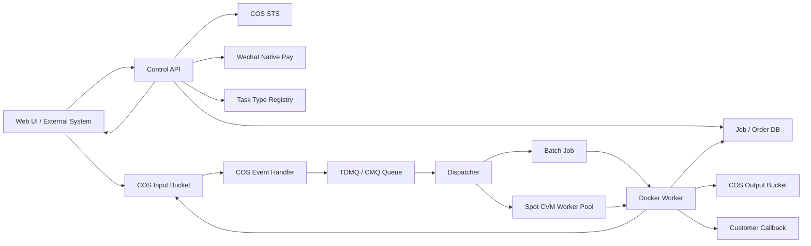
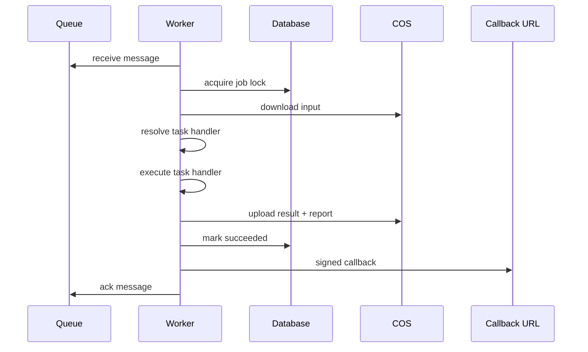

# Design Document: Tencent Cloud Elastic Optimizer

## Overview

腾讯云弹性优化平台将当前同步 Express 服务拆分为控制面、数据面、队列调度面、任务类型注册表和计算面。Web API 不再直接执行耗时任务，而是负责鉴权、计费、上传授权、状态查询和回调管理。输入文件通过 COS 保存，任务通过队列削峰，Worker 使用 Docker 镜像在 Batch 或 Spot CVM 上按需运行。模型优化是第一个 task type，架构必须支持后续扩展更多重后端任务。

设计重点：

1. **文件不进 API 进程**：大文件通过 COS 直传。
2. **任务异步化**：API 创建任务，Worker 异步处理。
3. **按 slot 调度**：一台弹性服务器可配置多个 Worker_Slot。
4. **可中断可重试**：Spot 回收不会丢文件、丢状态或丢结果。
5. **付费先行**：Web 单次任务使用微信 Native 扫码，API 租户可扩展余额/套餐。
6. **任务类型可插拔**：共享平台不写死模型优化逻辑。

## Architecture



## Runtime Components

### Control API

Control API remains an Express application and owns externally visible APIs:

```text
POST /api/v1/jobs
GET  /api/v1/jobs/:jobId
POST /api/v1/jobs/:jobId/complete-upload
POST /api/v1/jobs/:jobId/cancel
GET  /api/v1/jobs/:jobId/result-url

POST /api/v1/cos/events
POST /api/v1/payments/wechat/native
POST /api/v1/payments/wechat/notify
GET  /api/v1/orders/:orderId
POST /api/v1/callbacks/:deliveryId/replay
```

The current endpoints stay available during migration:

```text
POST /api/optimize
POST /api/optimize/stream
GET  /api/status/:taskId
GET  /api/download/:taskId
```

### COS Storage

COS is the durable storage boundary.

```text
inputs/{tenantId}/{jobId}/source.{ext}
inputs/{tenantId}/{externalJobId}/job.json
outputs/{tenantId}/{jobId}/optimized.glb
outputs/{tenantId}/{jobId}/report.json
outputs/{tenantId}/{jobId}/worker.log.jsonl
```

API-created jobs use an exact `inputKey`. COS-only jobs use an incoming folder plus manifest.

### Queue

Messages carry identifiers, not binary payloads.

```json
{
  "jobId": "job_01j...",
  "tenantId": "tenant_123",
  "taskType": "model.optimize",
  "attempt": 1,
  "traceId": "trace_..."
}
```

Queue semantics:

- ACK only after result and status are durably written.
- Retry by visibility timeout for crashes and Spot interruption.
- Dead-letter after max attempts.
- Idempotency by `jobId`.

### Dispatcher

Dispatcher runs as a separate lightweight process. It observes the shared Job database, estimates required slots, and updates Tencent AS desired capacity. One Dispatcher instance can be scoped to one `taskType`; future heavy services can run their own Dispatcher against different AS groups.

```text
required_slots = queued_jobs + retry_ready_jobs + active_processing_jobs + expired_processing_jobs
needed_instances = ceil(required_slots / slots_per_instance)
target_instances = clamp(needed_instances, min_instances, max_instances)
```

Dispatcher backends:

1. Tencent AS scaling group.
2. Batch submit job.
3. Local Docker worker for development.

Current production rollout starts with the SA9 fallback AS group. BF1 pools are already created and can be enabled later by changing `DISPATCHER_AS_GROUP_IDS`.

### Docker Worker

Worker image extends the current Dockerfile dependency set. Each slot runs one optimization at a time.

Worker flow:



The Worker must not rely on local disk after completion. Local files are temporary scratch data.

### Task Type Registry

The platform must treat model optimization as one registered heavy task.

Initial task:

```text
model.optimize
```

Future task examples:

```text
video.transcode
file.convert
texture.compress
cad.preview
ai.batch-infer
```

Task handler contract:

```typescript
interface HeavyTaskHandler<TPayload, TResult> {
  type: string;
  version: string;
  validate(payload: TPayload): void;
  estimateCost(payload: TPayload): Promise<number>;
  selectResourceClass(payload: TPayload): Promise<string>;
  execute(context: HeavyTaskExecutionContext, payload: TPayload): Promise<TResult>;
  buildReport(result: TResult): Promise<HeavyTaskReport>;
}
```

Shared systems depend on `taskType`, resource class and standard reports. Task-specific code owns conversion, processing and result interpretation.

## Data Model

### tenants

```text
id, name, status, billing_mode, created_at, updated_at
```

### api_keys

```text
id, tenant_id, key_hash, scopes, status, created_at, last_used_at
```

### jobs

```text
id, tenant_id, external_job_id, idempotency_key
task_type, task_version, task_payload_json, resource_class
status, preset, options_json
input_bucket, input_region, input_key, input_etag
output_bucket, output_region, output_key, report_key
callback_url, callback_secret_id
attempts, max_attempts, error_code, error_message
created_at, uploaded_at, queued_at, started_at, completed_at
```

### orders

```text
id, tenant_id, job_id, status
amount_cents, currency
provider, out_trade_no, transaction_id
code_url, expires_at, paid_at
created_at, updated_at
```

### workers

```text
id, instance_id, backend, status
slots_total, slots_busy
last_heartbeat, draining, started_at
```

### callback_deliveries

```text
id, job_id, event_type, url, status
attempts, last_status_code, next_retry_at
created_at, updated_at
```

## State Machines

### Job

```text
waiting_upload -> waiting_payment -> queued -> processing -> succeeded
waiting_upload -> queued -> processing -> failed
queued -> cancelled
processing -> retry_wait -> queued
```

`waiting_payment` is skipped for prepaid API tenants.

### Order

```text
created -> pending_payment -> paid
pending_payment -> expired
pending_payment -> cancelled
paid -> refunded
```

### Worker

```text
starting -> active -> draining -> terminated
active -> lost
```

## Payment Design

Wechat Native payment is used for scan-to-pay. The Web product uses WeChat login plus a prepaid wallet so users do not need to scan and pay for every single model optimization.

Frontend payment and invoice structure is documented in `docs/frontend-payment-invoice-design.md`.

1. Control API creates an Order.
2. Billing service calls Wechat Native prepay.
3. API returns `code_url` and `orderId`.
4. Web UI renders QR code.
5. Wechat sends payment notification to API.
6. API verifies signature, decrypts payload, marks Order paid.
7. Recharge Order is posted into the user's wallet ledger.
8. Job creation freezes `100` cents.
9. Job success charges the frozen balance; system failure or pre-start cancellation releases it.

Payment callback handling must be idempotent because Wechat can retry notifications.

Invoice center rules:

- Invoiceable amount is consumed cash amount minus already invoiced amount and refunded amount.
- Unused balance, frozen balance and bonus balance are not invoiceable.
- Launch phase supports manual digital ordinary invoice issuance and download URL backfill.
- Later phases can integrate WeChat Pay e-invoice or a third-party invoice provider.

## Callback Design

Callback signature:

```text
signature_payload = timestamp + "." + rawBody
signature = HMAC_SHA256(callbackSecret, signature_payload)
```

Headers:

```text
X-Optimizer-Event
X-Optimizer-Job-Id
X-Optimizer-Timestamp
X-Optimizer-Signature
```

Retries:

```text
1m, 5m, 15m, 1h, 6h, 24h
```

## Security

- API keys are stored as hashes.
- COS STS credentials are scoped to exact object prefixes.
- Wechat private keys and callback secrets never appear in logs.
- ZIP extraction must reject absolute paths and `..` traversal.
- Tenant limits apply before queueing.
- All state transitions are idempotent.

## Project Structure

New implementation areas:

```text
src/cloud/       Tencent Cloud adapters: COS, queue, Batch, CVM
src/jobs/        Job creation, state machine, repository contracts
src/tasks/       Task type registry and heavy task handler contracts
src/worker/      Docker worker entrypoints and slot runtime
src/billing/     Wechat payment and tenant billing contracts
src/callbacks/   Signed callback delivery and retry logic
```

Existing areas continue to own current behavior:

```text
src/components/  Format conversion and optimization pipeline
src/routes/      Current HTTP routes and future v1 routes
src/models/      Existing optimization/task/error models
src/utils/       Storage, validation, logging, option validation
```

## Deployment Topology

Minimum production topology:

- 1 small always-on Control API instance.
- Managed database.
- COS input/output bucket.
- TDMQ/CMQ queue.
- Batch compute environment or Spot CVM worker group.
- Optional 1 on-demand fallback Worker.

Development topology:

- Docker Compose API.
- Local filesystem storage.
- In-memory or local fake queue.
- Manual Worker command for one Job.
