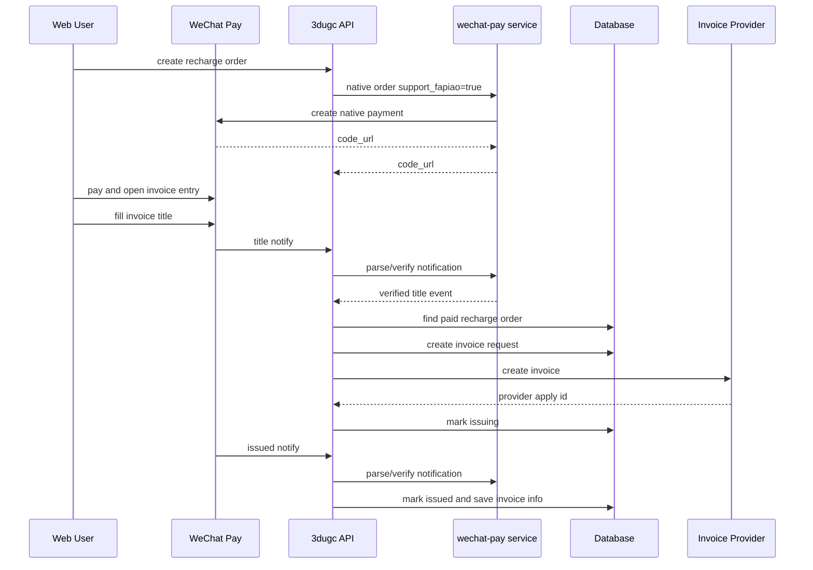

# Design Document: WeChat Recharge Invoice MVP

## Overview

最简单开票功能以“充值订单”为边界，不先做站内消费后开票。充值成功后，微信支付凭证页或账单页提供“开发票”入口。用户填写抬头后，微信支付通知本系统。本系统验签解密通知、匹配充值订单、创建发票申请、调用发票 provider 开票、保存开票结果，并在已开票订单退款时要求先冲红。



## Scope

In scope:

- Reuse existing `WECHAT_PAY_SUPPORT_FAPIAO` and `supportFapiao` plumbing.
- Add invoice persistence and service layer.
- Add WeChat invoice notification endpoints.
- Add recharge-order invoice query/download endpoints.
- Add refund guard for issued recharge invoices.
- Add admin retry/reverse APIs at service boundary.

Out of scope:

- Standalone `/app/invoices` full UI.
- Consumption-based available invoice amount.
- Enterprise monthly invoice workflow.
- Discount/bonus invoice allocation.
- Full tax-control UI for finance users.

## Data Model

### `invoice_requests`

```text
id
user_id
tenant_id
recharge_order_id
out_trade_no
amount_cents
currency
status
invoice_type
title_type
title
tax_no
email
phone_masked
provider
provider_apply_id
provider_invoice_id
invoice_no
download_url
failure_reason
created_at
submitted_at
issued_at
reversed_at
updated_at
```

Suggested statuses:

```text
submitted
issuing
issued
failed
reverse_pending
reversed
cancelled
manual_review
```

### `invoice_items`

```text
id
invoice_request_id
recharge_order_id
wallet_ledger_id nullable
description
amount_cents
created_at
```

For the MVP, `recharge_order_id` is required.

### `invoice_provider_events`

```text
id
provider
event_type
dedupe_key
resource_id
invoice_request_id nullable
recharge_order_id nullable
processed_at
created_at
```

Store raw decrypted notification data only if required for audit and only in a protected store. Default implementation should avoid persisting raw sensitive payloads.

## Modules

```text
src/invoices/
  types.ts
  invoice-service.ts
  invoice-store.ts
  local-invoice-store.ts
  mysql-invoice-store.ts
  invoice-provider.ts
  manual-invoice-provider.ts
  wechat-fapiao-provider.ts
  index.ts
```

### `InvoiceService`

Responsibilities:

- Parse verified WeChat title event.
- Match paid `RechargeOrder`.
- Enforce one active invoice per recharge order.
- Create `InvoiceRequest` and `InvoiceItem`.
- Submit invoice through provider.
- Handle issued notification.
- Expose user query/download methods.
- Guard refund workflows.

### `InvoiceProvider`

```ts
interface InvoiceProvider {
  createInvoice(input: CreateRechargeInvoiceInput): Promise<CreateInvoiceResult>;
  queryInvoice(providerApplyId: string): Promise<QueryInvoiceResult>;
  getDownloadUrl(input: InvoiceDownloadInput): Promise<InvoiceDownloadResult>;
  reverseInvoice(input: ReverseInvoiceInput): Promise<ReverseInvoiceResult>;
}
```

Provider choices:

- `manual`: creates records and waits for admin-issued state.
- `wechat_fapiao`: calls WeChat electronic invoice APIs or delegates to `wechat-pay`.
- `third_party`: future bridge to a tax-control/e-invoice vendor.

For simplest rollout, implement `manual` plus the WeChat notification ingestion first, then replace create/query/download with `wechat_fapiao` when API fields are confirmed.

## API Design

### Public WeChat notification endpoints

```text
POST /api/v1/invoices/wechat/notify
POST /api/v1/invoices/wechat/title-notify
POST /api/v1/invoices/wechat/issued-notify
POST /api/v1/invoices/wechat/reverse-notify
```

These endpoints do not use Web login. They must:

- Verify WeChat signature.
- Decrypt notification resource.
- Deduplicate by provider event id/resource id.
- Return WeChat-compatible success/failure payload.

### User endpoints

```text
GET /api/v1/account/wallet/recharge-orders/:orderId/invoice
GET /api/v1/account/wallet/recharge-orders/:orderId/invoice/download-url
```

These endpoints use `requireWebUser`.

### Admin endpoints

```text
GET  /api/v1/admin/invoices
GET  /api/v1/admin/invoices/:invoiceRequestId
POST /api/v1/admin/invoices/:invoiceRequestId/retry
POST /api/v1/admin/invoices/:invoiceRequestId/mark-issued
POST /api/v1/admin/invoices/:invoiceRequestId/reverse
```

Admin auth can be scoped later. MVP may implement service methods and keep HTTP admin routes behind existing admin/API-key middleware.

## WeChat Payment Integration

Existing recharge order creation already passes:

```ts
supportFapiao: config.billing.wechatSupportFapiao
```

Deployment policy:

```text
WECHAT_PAY_SUPPORT_FAPIAO=false  # before invoice MVP is ready
WECHAT_PAY_SUPPORT_FAPIAO=true   # after invoice MVP acceptance
```

When enabled, every recharge native order should include `support_fapiao=true`.
Because WeChat Pay electronic invoice no longer supports direct merchant integration for this case, production should use service-provider mode:

- `WECHAT_PAY_MODE=partner`
- service-provider signing identity: `WECHAT_PAY_SP_APP_ID`, `WECHAT_PAY_SP_MCH_ID`
- business sub-merchant identity: `WECHAT_PAY_SUB_MCH_ID`
- Native order endpoint: `/v3/pay/partner/transactions/native`
- preflight check: `POST /v3/new-tax-control-fapiao/merchant/{sub_mchid}/check`

## Refund Guard

Before any recharge refund workflow:

1. Query invoice by `recharge_order_id`.
2. If no invoice or status is `failed/cancelled/reversed`, allow normal refund policy.
3. If status is `submitted/issuing/issued/reverse_pending`, block automatic refund.
4. If `issued`, require reverse invoice first.

## Error Handling

- Missing recharge order: return success to WeChat after recording `manual_review`, or return retryable failure based on provider recommendation.
- Unpaid recharge order: record `manual_review`, do not issue invoice.
- Duplicate event: return success.
- Provider create failure: mark `failed`, allow admin retry.
- Download not ready: return `INVOICE_NOT_READY`.

## Security

- Do not log raw decrypted notification payloads by default.
- Mask tax numbers, phones and emails in logs.
- Keep merchant private key in `wechat-pay` service or mounted secret path.
- Business API should delegate WeChat signature/decrypt calls to the existing payment service where possible.

## Deployment

1. Ship code with `WECHAT_PAY_SUPPORT_FAPIAO=false`.
2. Apply for WeChat Pay service-provider electronic invoice ability and invite/authorize the sub-merchant.
3. Configure WeChat electronic invoice callback URLs and service-provider development config.
4. Run notification parsing smoke tests.
5. Run one small real recharge and invoice test in controlled account.
6. Set `WECHAT_PAY_SUPPORT_FAPIAO=true` in Portainer and redeploy.
7. Verify WeChat payment receipt shows invoice entry.

## References

- `docs/wechat-electronic-invoice-integration.md`
- `docs/frontend-payment-invoice-design.md`
- WeChat Native `support_fapiao`: `https://pay.wechatpay.cn/doc/v3/merchant/4012791877`
- WeChat Partner Native `support_fapiao`: `https://pay.wechatpay.cn/doc/v3/partner/4012738659`
- WeChat Partner sub-merchant invoice status check: `https://pay.wechatpay.cn/doc/v3/partner/4012474022`
- WeChat title notification: `https://pay.wechatpay.cn/doc/v3/merchant/4012286009`
- WeChat invoice download info: `https://pay.wechatpay.cn/doc/v3/merchant/4012538335`
