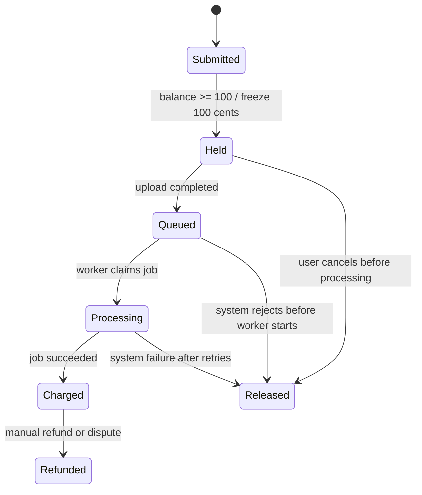

# 微信登录、充值和发票设计

本文档记录 `3dugc.com` 面向普通 Web 用户的前端结构、充值扣费规则和发票接入方案。它归入 P1 微信支付一起实施，后续也可复用到其他重后端任务类型。

## 设计结论

- 用户用微信登录后进入工作台，余额充值后提交任务。
- 每次模型优化任务标准价为 `1.00` 元，即 `100` 分。
- 下单任务时先冻结 `100` 分余额，任务成功后正式扣费。
- 系统失败、Worker 被回收且重试后仍未完成、用户在任务开始前取消时，释放冻结余额。
- 充值使用微信支付 Native / JSAPI，支付成功后只做余额入账，不直接开票。
- 发票按“已实际消费金额”申请，避免充值后退款、赠送额度和重复开票的问题。
- 默认支持数电普通发票；增值税专用发票先走人工审核。
- 没有统一的法定最低开票金额门槛，产品上可设置“自动开票建议满 `10` 元”，但用户确实索取时应保留小额手动开票通道。

## 发票合规判断

依据《中华人民共和国发票管理办法》，单位和个人提供服务并收取款项时，收款方应向付款方开具发票。这里的模型优化是有偿在线服务，所以系统需要具备开票能力。

全国推广的数电发票已经具备与纸质发票同等法律效力，适合这种小额、高频、线上交付的场景。建议先接普通数电发票，等企业客户增多后再补充专票流程。

需要让财务或税务顾问最终确认的点：

- 开票主体必须与收款主体、微信支付商户主体一致。
- 具体税目、税率、是否能开专票，由公司纳税人类型和经营范围决定。
- 充值是否可立即开“预付/充值”类发票要由财务确认；本系统默认按消费后开票，风险和退款成本更低。

## 充值规则

启动期不做折扣，先保证账务简单：

| 充值档位 | 可处理次数 | 发票口径 | 适用用户 |
| --- | ---: | --- | --- |
| 10 元 | 10 次 | 消费后可开 10 元 | 试用和低频用户 |
| 30 元 | 30 次 | 消费后按已用金额开票 | 普通个人用户 |
| 50 元 | 50 次 | 消费后按已用金额开票 | 小团队 |
| 100 元 | 100 次 | 消费后按已用金额开票 | 高频用户/API 用户 |

暂不建议做“充 100 送 5 次”。如果后续做优惠，赠送部分必须作为 `bonus_balance` 或优惠券记录，不能按现金余额开票。

余额规则：

- 付费余额长期有效，不设置过期时间。
- 未消费现金余额支持原路退款，先人工审核。
- 赠送余额或优惠券可设置有效期，但不计入可开票金额。
- 余额不足 `1.00` 元时，不能创建付费任务。
- API 租户后续共用同一钱包模型，但可以绑定企业账号、API Key 和月结额度。

## 扣费状态机



扣费落账：

- `hold`: 创建任务时冻结余额。
- `charge`: 任务成功后从冻结余额转为消费。
- `release`: 未开始或系统失败时释放冻结余额。
- `refund`: 已消费后退款，生成红冲/退款流水。

## 前端信息架构

第一屏直接进入可用工作台，不做营销首页。

```text
/
  登录态：跳转 /app
  未登录：展示微信登录

/login
  微信扫码登录
  微信内浏览器网页授权登录

/app
  顶部余额
  上传模型
  预计扣费 1 元确认
  任务列表

/app/wallet
  当前余额
  充值档位
  微信支付二维码
  充值订单
  余额流水

/app/invoices
  可开票金额
  已开票金额
  发票抬头管理
  发票申请列表
  下载发票

/app/api-keys
  API Key
  COS 上传接入说明
  回调地址和签名密钥
```

核心组件：

- `AuthGate`: 登录态守卫。
- `WechatLoginButton`: 桌面扫码登录和微信内网页授权。
- `BalanceBadge`: 顶部余额和冻结金额。
- `RechargePanel`: 充值档位选择。
- `PaymentQRCodeDialog`: 微信支付二维码、倒计时、支付状态轮询。
- `JobCostConfirm`: 提交任务前展示单价、余额和扣费说明。
- `WalletLedgerTable`: 余额流水。
- `InvoiceProfileForm`: 个人/企业抬头表单。
- `InvoiceRequestDrawer`: 开票金额、项目、邮箱、状态。

## API 结构

认证：

```text
POST /api/v1/auth/wechat/qr-login
GET  /api/v1/auth/wechat/callback
POST /api/v1/auth/logout
GET  /api/v1/me
```

钱包和支付：

```text
GET  /api/v1/wallet
GET  /api/v1/wallet/ledger
POST /api/v1/wallet/recharge-orders
GET  /api/v1/wallet/recharge-orders/:orderId
POST /api/v1/payments/wechat/notify
```

任务扣费：

```text
POST /api/v1/jobs
POST /api/v1/jobs/:jobId/complete-upload
POST /api/v1/jobs/:jobId/cancel
GET  /api/v1/jobs/:jobId
```

发票：

```text
GET  /api/v1/invoices/summary
GET  /api/v1/invoice-profiles
POST /api/v1/invoice-profiles
POST /api/v1/invoice-requests
GET  /api/v1/invoice-requests
GET  /api/v1/invoice-requests/:invoiceRequestId
GET  /api/v1/invoice-requests/:invoiceRequestId/download-url
```

## 数据模型

```text
users
  id
  wechat_openid
  wechat_unionid
  nickname
  avatar_url
  created_at

wallets
  user_id
  cash_balance_cents
  bonus_balance_cents
  frozen_cents
  updated_at

wallet_ledger
  id
  user_id
  type
  cash_delta_cents
  bonus_delta_cents
  frozen_delta_cents
  order_id
  job_id
  invoice_request_id
  created_at

recharge_orders
  id
  user_id
  out_trade_no
  amount_cents
  status
  code_url
  paid_at
  transaction_id
  created_at

job_charges
  id
  job_id
  user_id
  amount_cents
  status
  held_at
  charged_at
  released_at
  refunded_at

invoice_profiles
  id
  user_id
  type
  title
  tax_no
  email
  phone
  bank_name
  bank_account
  address
  is_default

invoice_requests
  id
  user_id
  profile_id
  amount_cents
  status
  provider
  provider_invoice_id
  file_url
  created_at
  issued_at

invoice_items
  id
  invoice_request_id
  wallet_ledger_id
  amount_cents
```

## 微信支付和发票接入

微信支付：

- PC 桌面用 Native 下单，后端拿到 `code_url`，前端生成二维码。
- 微信内网页可补 JSAPI 支付，减少扫码跳转。
- `notify_url` 必须是公网 HTTPS，回调只接受验签和解密成功的通知。
- 下单时设置订单过期时间，过期后主动关单。
- 微信支付回调需要幂等处理，同一个 `out_trade_no` 只能入账一次。

微信发票入口：

- 微信支付 Native 下单支持 `support_fapiao` 字段，开通电子发票能力后，支付成功页和账单详情页可以出现开票入口。
- 该入口适合“按充值订单申请发票”的模式。
- 本系统默认“按消费后开票”，因此先在站内发票中心做主流程；后续若财务确认可按充值开票，再打开 `support_fapiao=true`。

电子发票服务：

- 第一阶段：站内收集抬头和消费明细，财务后台手动开数电发票，回填发票文件或下载链接。
- 第二阶段：接微信支付电子发票 API 或第三方电子发票服务商，自动开票、查询状态、下载文件。
- 第三阶段：企业 API 客户支持月结账单和批量开票。

## 开票产品规则

- 可开票金额 = 已消费现金金额 - 已开票金额 - 已退款金额。
- 冻结金额、未消费余额、赠送余额不进入可开票金额。
- 个人发票只需要抬头、邮箱。
- 企业普通发票需要抬头、税号、邮箱。
- 专票需要开户行、账号、地址、电话，先人工审核。
- 自动开票建议最低 `10` 元。
- 小于 `10` 元的消费允许累计；用户明确要求时保留人工小额开票入口。
- 退款已开票订单时，需要先确认冲红或开红字发票流程。

## 实施顺序

1. 增加 `users`、`wallets`、`wallet_ledger`、`recharge_orders`、`job_charges` 表。
2. 接微信登录，拿到 `openid/unionid` 并建立用户。
3. 实现钱包页和微信充值下单。
4. 支付回调验签、解密、幂等入账。
5. `POST /api/v1/jobs` 改为余额冻结后创建任务。
6. Worker 成功完成后正式扣费，系统失败释放冻结。
7. 增加发票中心和发票抬头。
8. 先做人工开票流转，再接电子发票 API。

## 参考资料

- 《中华人民共和国发票管理办法》：<https://fgk.chinatax.gov.cn/zcfgk/c100010/c5195084/content.html>
- 国家税务总局关于推广应用全面数字化电子发票的公告：<https://www.gov.cn/zhengce/zhengceku/202411/content_6989164.htm>
- 微信支付 Native 下单：<https://pay.wechatpay.cn/doc/v3/merchant/4012791877>
- 微信支付电子发票开发指引：<https://pay.wechatpay.cn/doc/v3/merchant/4012065074>
- 微信支付获取用户填写的抬头：<https://pay.wechatpay.cn/doc/v3/merchant/4012538112>
- 微信支付获取发票下载信息：<https://pay.wechatpay.cn/doc/v3/merchant/4012538335>
