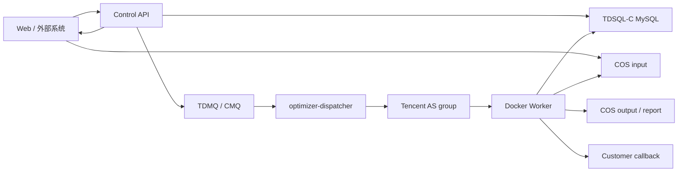

# 重后端任务平台落地方案

本文档是当前腾讯云弹性模型优化服务的落地总览。它把设计、代码边界、云资源、部署方式和后续扩展方式整理成一份可执行说明，方便后续把视频转码、CAD 预览、AI 批处理等其他重后端任务接入同一套平台。

安全约定：本文档只记录资源名称、拓扑、流程和操作顺序。数据库密码、API Key、CAM Secret、镜像仓库密码、微信支付私钥等敏感值不得写入仓库，只能放在 Portainer 环境变量、腾讯云密钥管理、服务器本地环境文件或 GitHub Secrets 中。

## 当前落地状态

已落地：

- 入口 API 运行在 Portainer Stack `model-optimizer`，入口域名为 `https://optimizer.7dgame.com`。
- Docker 镜像通过 GitHub Actions 构建并推送到腾讯云镜像仓库，只保留 `latest` tag，CI 会清理历史 `sha-*` tag。
- 输入、输出、报告文件统一落腾讯云 COS bucket `model-optimizer-1251022382`。
- 任务队列使用 TDMQ/CMQ 队列 `optimizer-jobs`，死信队列为 `optimizer-jobs-dlq`。
- 共享状态库使用 TDSQL-C MySQL 集群 `cynosdbmysql-o6c4ezij`，schema 为 `async_task_platform`。
- 弹性 Worker 使用腾讯云 AS 伸缩组，当前 Dispatcher 只控制 SA9 兜底组 `asg-pj6qaput`。
- `optimizer-dispatcher` 已部署到 Portainer，会按数据库中的 Job backlog 自动调整 AS desired capacity。
- 运行时 CAM 子账号 `modeloptimizer` 已移除临时 `QcloudASFullAccess` 和 `QcloudTATFullAccess`，只保留 AS 最小权限和 COS/CMQ runtime 策略。
- 入口 CVM 和 Worker AS 启动配置已绑定运行时 CAM 角色 `model-optimizer-runtime-role`；Portainer Stack 不再向容器注入腾讯永久密钥。
- 已完成多次真实 smoke test，验证链路为：提交任务、Dispatcher 自动扩容、Worker 处理、COS 写回、状态更新、Dispatcher 缩容。
- 已完成真实强杀 Worker 恢复演练，验证 Worker 被释放后任务会在租约过期后重新投递，并由新 Worker 接手完成。
- 已完成实例角色 smoke test，验证 API、Dispatcher、CMQ、COS、AS 和 Worker 全链路可在无永久腾讯密钥环境下运行。

待落地：

- 最终确认后停用旧 `modeloptimizer` 永久 API key，不创建新的 key。
- 接入微信 Native 支付和外部客户回调密钥管理。
- 给外部系统开放 COS-only manifest 接入或正式 STS 直传接入。

## 目标架构

模型优化只是第一个任务类型。平台目标是把任何“重后端任务”抽象成统一的异步任务：

1. 客户系统或 Web 前端创建任务。
2. 输入文件上传到 COS。
3. API 写入 Job 状态并投递队列。
4. Dispatcher 根据 backlog 拉起弹性 Worker。
5. Worker 从 COS 下载输入，执行对应 task handler，上传输出到 COS。
6. API 或 Worker 更新状态，按需发送客户回调。
7. 队列清空后 Dispatcher 自动缩容，释放临时算力。



## 生产资源清单

| 类别 | 当前资源 | 用途 |
|---|---|---|
| 入口域名 | `https://optimizer.7dgame.com` | Control API |
| Portainer Stack | `model-optimizer` | 部署 `optimizer-api` 和 `optimizer-dispatcher` |
| 镜像仓库 | `hkccr.ccs.tencentyun.com/plugins/3d-model-optimizer:latest` | API、Dispatcher、Worker 共用镜像 |
| COS | `model-optimizer-1251022382` | 输入模型、输出模型、报告文件 |
| CMQ | `optimizer-jobs` | 任务队列 |
| CMQ DLQ | `optimizer-jobs-dlq` | 死信队列 |
| 数据库 | `cynosdbmysql-o6c4ezij` / `async_task_platform` | Job、Order、Worker、Callback 状态 |
| Worker 镜像 | `model-optimizer-worker-elastic-20260527-latest1` / `img-om8cggg4` | AS 创建 Worker CVM 的自定义镜像 |
| SA9 AS 组 | `asg-pj6qaput` / `asc-3x9u29bv` | 当前 Dispatcher 生产控制组，启动配置已绑定运行时角色 |
| BF1 组 | `asg-ov9ndzql` / `asc-pmmp5l4p`、`asg-o7ii5sub` / `asc-8er874b5`、`asg-9f3nd5an` / `asc-ai38mm43` | 后续成本优化候选 Worker 池，启动配置已绑定运行时角色 |
| CAM 用户 | `modeloptimizer` | API、Dispatcher、Worker 运行时账号 |
| CAM 角色 | `model-optimizer-runtime-role` | 入口 CVM 和弹性 Worker 实例角色 |
| AS 最小权限策略 | `model-optimizer-dispatcher-as-minimal` | 只允许查询和修改 `asg-pj6qaput` desired capacity |
| Runtime 权限策略 | `model-optimizer-runtime-policy` | COS/CMQ 运行时访问 |

## 代码边界

| 模块 | 位置 | 责任 |
|---|---|---|
| API routes | `src/routes` | HTTP 入口、鉴权、任务创建和查询 |
| Cloud providers | `src/cloud` | COS、CMQ、本地 provider 抽象 |
| Job state | `src/jobs` | Job 状态机、租约、重试、状态更新 |
| Database | `src/database` | MySQL/Postgres 共享状态表和 repository |
| Task registry | `src/tasks` | `taskType` 注册和 handler 路由 |
| Model optimize handler | `src/tasks/model-optimize*` | 复用现有转换与优化流水线 |
| Worker runtime | `src/worker` | 拉取队列任务、续租、执行 handler、上传结果 |
| Dispatcher | `src/dispatcher` | 根据 backlog 计算目标实例数并调用 AS |
| Billing | `src/billing` | 微信支付/mock billing 抽象 |
| Callback | `src/callbacks` | 客户回调签名、重试和投递记录 |

## 运行时进程

### optimizer-api

API 是常驻入口服务，运行在 Portainer 入口服务器上。它不处理大模型优化，只做轻量控制面工作：

- 创建 Job。
- 生成或接收 COS input 信息。
- 写数据库。
- 投递 CMQ。
- 提供 Job 查询和结果 URL。
- 后续承接微信支付、租户、API Key、回调管理。

### optimizer-dispatcher

Dispatcher 是轻量控制循环，运行在 Portainer 入口服务器上。它不处理模型文件，只读取数据库 backlog 并调整 AS desired capacity。

当前公式：

```text
required_slots = queued_jobs + retry_ready_jobs + active_processing_jobs + expired_processing_jobs
needed_instances = ceil(required_slots / slots_per_instance)
target_instances = clamp(needed_instances, min_instances, max_instances)
```

当前生产配置：

```text
DISPATCHER_PROVIDER=tencent-as
DISPATCHER_TASK_TYPE=model.optimize
DISPATCHER_AS_GROUP_IDS=asg-pj6qaput
DISPATCHER_INTERVAL_SECONDS=30
DISPATCHER_SLOTS_PER_INSTANCE=1
DISPATCHER_MIN_INSTANCES=0
DISPATCHER_MAX_INSTANCES=3
DISPATCHER_DRY_RUN=false
```

### Worker

Worker 运行在 AS 自动创建的 CVM 上，由自定义镜像和 systemd/Docker 启动。Worker 只处理队列任务，不承载公网入口。

Worker 必须满足：

- 使用唯一 `WORKER_ID`，优先从 CVM metadata 生成。
- 从 COS 下载输入到本地临时目录。
- 处理期间续租 Job，避免长任务被误回收。
- Spot 回收通知到来时进入 draining，不再领取新任务。
- 结果、报告和错误信息都写入共享状态或 COS。
- 本地磁盘只做临时缓存，不作为状态事实来源。

## 任务生命周期

| 状态 | 说明 |
|---|---|
| `waiting_upload` | Job 已创建，等待输入上传 |
| `queued` | 输入已就绪，已投递队列 |
| `processing` | Worker 已领取并持有租约 |
| `succeeded` | 输出和报告已写回 COS |
| `failed` | 重试耗尽或不可恢复错误 |
| `cancelled` | 人工或业务取消 |

关键约束：

- Queue 消息不能比数据库状态更可信，最终状态以数据库为准。
- Worker 只有成功完成并更新 Job 后才 ACK 消息。
- Worker 异常退出或 Spot 被回收时，依赖租约过期和 CMQ 可见性超时重新投递。
- 所有 Job 创建必须支持幂等键，避免 COS 事件或客户重试造成重复扣费和重复处理。

## 部署方式

### 入口服务器

入口服务器只部署 API、Dispatcher、Traefik 和必要的 Portainer 管理服务，不跑重任务 Worker。

当前入口 Stack 应包含：

- `optimizer-api`
- `optimizer-dispatcher`

入口服务器不需要为 Worker 开公网端口，Worker 通过腾讯云内网、COS/CMQ/TDSQL-C API 工作。

### Worker 基准镜像

Worker 镜像落地步骤：

1. 准备一台基准 CVM。
2. 安装 Docker 和 Worker systemd 服务。
3. 配置运行时环境文件，不写死实例 ID。
4. 拉取 `hkccr.ccs.tencentyun.com/plugins/3d-model-optimizer:latest`。
5. 跑一次真实 CMQ/COS/TDSQL-C smoke test。
6. 从基准机创建自定义镜像。
7. 更新 AS 启动配置。
8. 将 AS 组缩回 `min=0`、`desired=0`。

### CI 镜像策略

当前只保留滚动 tag：

```text
hkccr.ccs.tencentyun.com/plugins/3d-model-optimizer:latest
```

原因：

- 腾讯云镜像仓库容量有限。
- 短哈希镜像对当前部署收益低。
- Worker 自定义镜像才是弹性 CVM 的可复现启动基线。

## 权限模型

运行时账号 `modeloptimizer` 当前只应保留：

- `model-optimizer-runtime-policy`
- `model-optimizer-dispatcher-as-minimal`

已移除：

- `QcloudASFullAccess`
- `QcloudTATFullAccess`

AS 最小权限策略只允许：

```text
as:DescribeAutoScalingGroups
as:ModifyDesiredCapacity
```

当前只授权：

```text
qcs::as:ap-nanjing:uin/59643:auto-scaling-group/asg-pj6qaput
```

如果未来把蜂驰组加入 Dispatcher，必须先扩展 CAM 策略资源，再修改 `DISPATCHER_AS_GROUP_IDS`。

## 新重后端服务接入

新增服务时不要复制基础设施，按以下顺序扩展：

1. 定义 `taskType`，例如 `video.transcode`、`cad.preview`、`ai.batch-infer`。
2. 在 `src/tasks` 注册新的 handler。
3. 约定输入 manifest、输出文件和 report schema。
4. 评估 CPU、内存、磁盘、GPU、超时和单机 slot。
5. 选择复用现有 Worker 镜像，或创建新的 Worker 镜像和 AS 组。
6. 为该 `taskType` 启动独立 Dispatcher，或扩展现有 Dispatcher 配置。
7. 配置租户并发、价格、回调和最大实例数。
8. 跑一条真实 smoke test 后再开放给外部系统。

建议目录：

```text
src/tasks/<task-type>/
  handler.ts
  schema.ts
  report.ts
  README.md
```

建议 COS 路径：

```text
tenants/{tenantId}/jobs/{jobId}/input/<source files>
tenants/{tenantId}/jobs/{jobId}/output/<result files>
tenants/{tenantId}/jobs/{jobId}/output/report.json
```

## 验收标准

每次上线或扩展新 task type，至少验证：

- API `/health` 正常。
- `POST /api/v1/jobs` 能创建任务并返回 `queued` 或等待上传状态。
- Dispatcher 能把目标 AS 组从 `0` 扩到 `1`。
- Worker 能消费真实队列任务，从 COS 读输入并写输出。
- Job 状态最终为 `succeeded`。
- 输出 key 和 report key 可查询。
- 队列清空后 AS 组回到 `desired=0`、`inService=0`。
- 日志中不出现明文密钥。
- 失败任务能重试或进入 failed/DLQ。

## 成本和容量保护

当前保护线：

- `DISPATCHER_MAX_INSTANCES=3`
- `DISPATCHER_MIN_INSTANCES=0`
- `DISPATCHER_SLOTS_PER_INSTANCE=1`
- Worker AS 组默认 `desired=0`
- 入口机不跑重任务
- 镜像仓库只保留 `latest`

扩容前必须先做压测：

- 2C2G：只适合极小模型或轻任务。
- 2C4G：小模型可试，默认 slot 仍建议 1。
- 4C8G：当前模型优化较稳的起点，默认 slot 1。
- 8C16G：可评估 slot 2，但要看内存峰值和转换工具稳定性。

## 后续路线

后续可执行任务统一记录在 `docs/heavy-task-platform-next-tasks.md`。优先级建议：

1. 将永久 CAM Secret 迁移到角色、STS 或密钥管理。
2. 最终确认后释放 Worker 基准机 `ins-big9dirk`。
3. 接入微信 Native 支付和订单状态机。
4. 开放外部系统 API Key、回调签名和回调重放。
5. 支持 COS-only manifest 接入。
6. 评估把 BF1 蜂驰 Worker 池加入 Dispatcher fallback 列表。

## 相关文档

- `docs/tencent-cloud-architecture.md`：目标架构和设计细节。
- `docs/heavy-task-platform-runbook.md`：云资源、部署记录和运维操作。
- `docs/heavy-task-platform-next-tasks.md`：上线后剩余工作的可勾选任务清单。
- `docs/tencent-cloud-deployment-checklist.md`：上线检查表。
- `.kiro/specs/tencent-cloud-elastic-optimizer`：需求、设计、plan 和 task。
