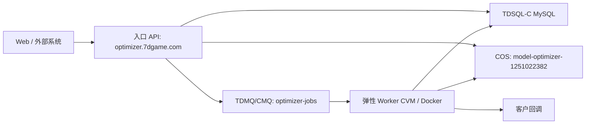

# Heavy Task Platform Runbook

本文档记录当前模型优化服务在腾讯云上的真实部署方式，并把它抽象成可复用的“重后端任务平台”。后续视频转码、CAD 预览、AI 批处理、文件转换等服务，都应优先沿用这套结构。

> 安全约定：本文档只记录资源名称、内网地址、部署拓扑和操作步骤。数据库密码、API Key、CAM Secret、镜像仓库密码、微信支付私钥等只进入 Portainer 环境变量、云控制台密钥管理或服务器本地环境文件，不写入仓库。

## 当前目标拓扑



当前采用 **入口常驻 + Worker 弹性池**：

- 入口服务器只跑 Control API，不跑重任务 Worker。
- 输入、输出、报告都在 COS。
- 任务状态、订单、Worker 心跳写入 TDSQL-C MySQL。
- 队列使用 TDMQ/CMQ，Worker 从队列拉任务。
- Worker 基准机用 Docker + systemd 启动容器；后续创建自定义镜像，再由竞价实例或伸缩组克隆。

## 已落地资源

| 类型 | 名称 / 地址 | 用途 | 状态 |
|---|---|---|---|
| 入口域名 | `https://optimizer.7dgame.com` | Control API 对外入口 | 已部署，可访问 |
| Portainer | `https://port.7dgame.com` | Docker Stack 管理 | 已部署 |
| COS bucket | `model-optimizer-1251022382` | 输入、输出、报告统一存储 | 已创建 |
| COS 地域 | `ap-nanjing` | 南京地域 | 已确认 |
| 队列 | `optimizer-jobs` | 主任务队列 | 已创建 |
| 死信队列 | `optimizer-jobs-dlq` | 超过重试次数的失败任务 | 已创建 |
| CMQ 内网地址 | `http://nj.mqadapter.cmq.tencentyun.com` | Worker 云内网消费队列 | 已确认 |
| CMQ 公网地址 | `https://cmq-nj.public.tencenttdmq.com` | 本地/入口公网联调 | 已确认 |
| 数据库 | TDSQL-C MySQL `cynosdbmysql-o6c4ezij` | 共享任务状态库 | 已接入 |
| 数据库内网 | `10.206.0.5:3306` | 云内网访问 MySQL | 已确认 |
| 数据库 schema | `async_task_platform` | 可复用重后端任务平台库 | 已创建 |
| 数据库账号 | `async_task_runtime@%` | API/Worker 运行时账号 | 已创建 |
| 镜像仓库 | `hkccr.ccs.tencentyun.com/plugins/3d-model-optimizer` | GitHub CI 推送镜像 | 已接入 |
| 入口 Stack | `model-optimizer` | Portainer API Stack | 已部署 |
| Worker 基准机 | `model-optimizer-worker-base` / `ins-big9dirk` | 制作 Worker 镜像的基准 CVM | 已停机，待确认后释放 |
| Worker 基准机内网 | `10.206.0.21` | Worker 访问 DB/CMQ/COS | 已确认 |
| Worker 基准机公网 | `119.45.240.220` | 临时管理入口 | 已确认 |
| Worker 自定义镜像 | `model-optimizer-worker-elastic-20260527-fix2` / `img-d9cslozu` | 弹性 Worker 克隆源，当前应缓存 `latest` | 已验证，当前使用 |
| 旧 Worker 镜像 | `model-optimizer-worker-elastic-20260527-fix1` / `img-hmvlx5n2` | 上一版 Worker 克隆源 | 已被 `img-d9cslozu` 替代 |
| 更旧 Worker 镜像 | `model-optimizer-worker-base-20260527` / `img-rxjo5rca` | 首版弹性 Worker 克隆源 | 已被 `img-hmvlx5n2` 替代 |
| CVM 启动模板 | `lt-model-optimizer-worker-spot` | CVM 购买页保存的竞价模板 | 已保存 |
| AS 启动配置 | `asc-model-optimizer-worker-spot-fix2-sa9` / `asc-onk753cj` | SA9 兜底弹性 Worker 配置 | 当前主兜底配置 |
| AS 伸缩组 | `asg-model-optimizer-worker-spot` / `asg-pj6qaput` | SA9 兜底 Worker 弹性池 | 已验证，`0/0` 起步 |
| 蜂驰 Worker 池 | `asg-model-optimizer-worker-bf1-large8` / `asg-ov9ndzql` | `BF1.LARGE8` 低成本 Worker 池 | 已创建，当前库存售罄时保持 `0/0` |
| 蜂驰 Worker 池 | `asg-model-optimizer-worker-bf1-medium4` / `asg-o7ii5sub` | `BF1.MEDIUM4` 2C4G Worker 池 | 已创建，`0/0` 起步 |
| 蜂驰 Worker 池 | `asg-model-optimizer-worker-bf1-medium2` / `asg-9f3nd5an` | `BF1.MEDIUM2` 2C2G Worker 池 | 已创建，`0/0` 起步 |

## 入口服务部署约定

Portainer Stack `model-optimizer` 只应保留 API 服务：

```text
optimizer-api
```

入口服务职责：

- API Key 鉴权。
- 创建异步 Job。
- 写数据库。
- 生成/记录 COS input/output key。
- 投递 CMQ 队列。
- 查询任务状态和结果。
- 微信支付下单和支付回调。
- 客户回调管理。

入口服务不应处理大模型优化任务。若 Portainer Stack 中还有 `optimizer-worker`，应在完成 Worker 弹性池后永久移除，避免入口服务器被 CPU/内存任务拖住。

## Worker 基准机部署约定

Worker 基准机用于制作后续竞价机器镜像，不承载长期入口流量。

基准机需要包含：

- Docker Engine。
- 腾讯云镜像仓库登录状态，或启动脚本内完成登录。
- `/etc/model-optimizer/worker.env`，保存运行时环境变量。
- `/opt/model-optimizer/run-worker.sh`，负责启动 Worker 容器。
- `model-optimizer-worker.service` systemd 服务。
- Worker 容器启动后能消费 `optimizer-jobs`，处理任务并写回 COS/TDSQL-C。

Worker 容器约定：

```text
WORKER_CONCURRENCY=1
WORKER_IDLE_EXIT_SECONDS=300
JOB_LEASE_SECONDS=300
EXPIRED_JOB_RECOVERY_INTERVAL_SECONDS=30
WORKER_SPOT_TERMINATION_CHECK_URL=http://metadata.tencentyun.com/latest/meta-data/spot/termination-time
WORKER_SPOT_TERMINATION_POLL_MS=5000
QUEUE_PROVIDER=tdmq-cmq
QUEUE_ENDPOINT=http://nj.mqadapter.cmq.tencentyun.com
QUEUE_NAME=optimizer-jobs
STATE_STORE_PROVIDER=mysql
DATABASE_URL=mysql://async_task_runtime:<password>@10.206.0.5:3306/async_task_platform
COS_INPUT_BUCKET=model-optimizer-1251022382
COS_OUTPUT_BUCKET=model-optimizer-1251022382
TENCENT_REGION=ap-nanjing
```

克隆镜像前必须保证 Worker ID 不固定。推荐在启动脚本中从腾讯云 metadata 获取实例 ID：

```bash
META_ID="$(curl -fsS --connect-timeout 2 http://metadata.tencentyun.com/latest/meta-data/instance-id 2>/dev/null || true)"
if [ -n "$META_ID" ]; then
  export INSTANCE_ID="$META_ID"
  export WORKER_ID="worker-cvm-$META_ID"
fi
```

然后在 `docker run` 中显式覆盖：

```bash
-e INSTANCE_ID="$INSTANCE_ID" \
-e WORKER_ID="$WORKER_ID"
```

否则从同一个镜像克隆出来的机器会共享同一个 `workerId`，排查日志和心跳会混乱。

当前 Worker 实例不绑定公网 IP。若没有 NAT 网关，`run-worker.sh` 不应使用 `docker run --pull always`，否则 Docker 会先访问镜像仓库并因公网超时导致 Worker 无法启动。修复后的镜像 `img-hmvlx5n2` 使用自定义镜像里已经缓存的 Docker 镜像启动，后续升级镜像时通过 GitHub CI 推新 tag，再重新制作 Worker 自定义镜像或补充内网/公网拉取通道。

竞价实例必须按“随时会中断”处理：

- Worker claim job 时写入 `leaseExpiresAt`，处理期间按 `JOB_LEASE_SECONDS` 自动续租。
- Worker 只在结果和报告写入 COS、DB 标记 `succeeded` 后 ACK CMQ。
- 如果 Worker 被回收，未 ACK 的 CMQ 消息会重新可见；新 Worker 只有在 job 租约过期后才能重新 claim。
- 如果 CMQ 消息在原 Worker 仍处理时提前重新可见，新的 Worker 会删除该 receipt 并投递一个延迟 watchdog 消息，避免消息丢失或重复并发处理。
- Worker 会轮询 `metadata.tencentyun.com/latest/meta-data/spot/termination-time`，收到回收时间后进入 draining，不再领取新任务。
- 后续应在 AS 伸缩组启用竞价实例回收监测，并增加缩容生命周期挂钩，用于平滑停止 Worker 和上传日志。

## Worker 验收记录

已完成一次真实远程 Worker smoke test：

```text
jobId=9fbd477f-62e6-4044-9c2c-5f7cc6f97b79
workerId=worker-cvm-ins-big9dirk
status=succeeded
attempts=1
outputKey=tenants/remote-worker-smoke/jobs/9fbd477f-62e6-4044-9c2c-5f7cc6f97b79/output/model.glb
```

这说明：

- API 可以把任务写入 TDSQL-C。
- API 可以把任务投递到真实 CMQ。
- Portainer 入口 Worker 已停止后，基准 CVM Worker 仍能消费任务。
- Worker 可以从 COS 读取输入、执行优化、写回 COS、更新状态。

已完成一次 AS 弹性 Worker smoke test：

```text
jobId=c7d3a25c-bd9a-4df0-aa90-b573c684b09d
workerId=worker-cvm-ins-j06vzfdw
status=succeeded
attempts=1
outputKey=tenants/elastic-worker-smoke/jobs/c7d3a25c-bd9a-4df0-aa90-b573c684b09d/output/model.glb
reportKey=tenants/elastic-worker-smoke/jobs/c7d3a25c-bd9a-4df0-aa90-b573c684b09d/output/report.json
```

验证过程：

- `ins-big9dirk` 已先停机，确认入口服务器不承担 Worker 任务。
- 伸缩组 `asg-pj6qaput` 从 `0` 扩到 `1`，自动创建 `ins-j06vzfdw`。
- 首版镜像暴露两个启动问题：shell 变量被错误转义、无公网实例使用 `--pull always` 拉镜像超时。
- 在 `ins-j06vzfdw` 热修 `run-worker.sh` 后，Worker 成功 claim 并完成测试任务。
- 从热修实例创建新镜像 `img-hmvlx5n2`，并创建新 AS 启动配置 `asc-rkmzzkyj`。
- 伸缩组切到新启动配置后，缩到 `0` 再扩到 `1`，新实例 `ins-fss90ts4` 自动启动 Worker 成功。
- 验证后伸缩组已缩回 `0`，不继续产生 Worker 竞价实例费用。

已完成一次新版租约恢复 Worker smoke test：

```text
jobId=8f68c9d7-95ed-4fee-9da4-c4e2e2fe5fa4
workerId=worker-cvm-ins-5q8pdmoy
status=succeeded
attempts=1
outputKey=tenants/elastic-worker-smoke/jobs/8f68c9d7-95ed-4fee-9da4-c4e2e2fe5fa4/output/model.glb
reportKey=tenants/elastic-worker-smoke/jobs/8f68c9d7-95ed-4fee-9da4-c4e2e2fe5fa4/output/report.json
```

验证过程：

- 发现 `sha-121dbaf` 在 TDSQL-C MySQL 上执行过期租约恢复时，`LIMIT ?` 预编译参数会触发 `ER_WRONG_ARGUMENTS`。
- 修复为先校验内部 limit 数字，再在 MySQL SQL 中使用安全后的字面量；提交 `d465f02`。
- GitHub CI 成功推送 `hkccr.ccs.tencentyun.com/plugins/3d-model-optimizer:sha-d465f02`。
- 基准机 `ins-big9dirk` 拉取 `sha-d465f02`，修复启动脚本并加入租约/Spot metadata 环境变量。
- 从基准机创建新版镜像 `img-d9cslozu`，再创建 AS 启动配置 `asc-onk753cj`。
- `BF1.LARGE8` 竞价库存返回 `SpotSoldOut`，所以本轮 smoke test 使用 SA9 兜底启动配置拉起 `ins-5q8pdmoy`。
- 测试任务成功后伸缩组已缩回 `0`，基准机已停机。
- 已额外创建 `BF1.LARGE8`、`BF1.MEDIUM4`、`BF1.MEDIUM2` 三档蜂驰 Worker 池，均为 `min=0`、`desired=0`。

## 创建 Worker 自定义镜像

镜像创建前检查：

- [ ] 入口 Stack 中本地 Worker 已停止或移除。
- [ ] 基准机 Worker 服务 `model-optimizer-worker.service` 正常运行。
- [ ] 启动脚本会按实例 metadata 生成唯一 `WORKER_ID`。
- [ ] `/etc/model-optimizer/worker.env` 不包含会阻止克隆的固定实例配置。
- [ ] 最新镜像 tag 已拉取成功。
- [ ] 用真实 CMQ/COS/TDSQL-C smoke test 通过。

建议镜像名：

```text
model-optimizer-worker-elastic-YYYYMMDD
```

建议描述：

```text
Model optimizer elastic worker baseline with Docker, systemd worker service, TDSQL-C, COS and CMQ runtime config.
```

创建后记录：

```text
CUSTOM_IMAGE_ID=img-hmvlx5n2
CUSTOM_IMAGE_NAME=model-optimizer-worker-elastic-20260527-fix1
SOURCE_INSTANCE=ins-j06vzfdw
STATUS=normal
CREATED_AT=2026-05-27 15:57 Asia/Shanghai
VERIFIED_AT=2026-05-27 16:02 Asia/Shanghai
SUPERSEDES_IMAGE_ID=img-rxjo5rca
```

## 弹性 Worker 池设计

第一阶段先使用竞价 CVM / 伸缩组，不立即接入 Batch。

推荐伸缩参数：

| 参数 | 建议值 | 说明 |
|---|---:|---|
| 最小实例数 | 0 | 无任务时不产生 Worker 费用 |
| 最大实例数 | 3 | 先防成本失控，压测后再调整 |
| 单机 slot | 1 | 当前 4C8G 基准机保守处理一个模型 |
| 扩容触发 | 队列可见消息数 > 当前空闲 slot | 后续由 Dispatcher 自动控制 |
| 缩容触发 | Worker 空闲 10-15 分钟 | 可用 `WORKER_IDLE_EXIT_SECONDS` 或伸缩组策略 |
| 失败重试 | 3 次 | 超过进入 DLQ / failed |

后续 Dispatcher 规则：

```text
required_slots = queued_jobs + retry_ready_jobs
idle_slots = active_slots - busy_slots
missing_slots = max(0, required_slots - idle_slots)
needed_instances = ceil(missing_slots / slots_per_instance)
```

调度约束：

- 全局最大实例数必须配置。
- 每个租户最大并发必须配置。
- 每个 `taskType` 可以配置不同实例规格、slot、价格和超时时间。
- Spot 回收时不 ACK 消息，依赖 CMQ 可见性超时重投。

### 当前 Worker 弹性池

已创建的弹性池：

```text
CVM_LAUNCH_TEMPLATE_NAME=lt-model-optimizer-worker-spot
AS_LAUNCH_CONFIGURATION_ID=asc-rkmzzkyj
AS_LAUNCH_CONFIGURATION_NAME=asc-model-optimizer-worker-spot-fix1
AS_GROUP_ID=asg-pj6qaput
AS_GROUP_NAME=asg-model-optimizer-worker-spot
REGION=ap-nanjing
VPC_ID=vpc-f479q8cx
SUBNET_ID=subnet-plfjkdvy
SECURITY_GROUP_ID=sg-2b438jsc
IMAGE_ID=img-hmvlx5n2
SUPERSEDED_IMAGE_ID=img-rxjo5rca
SUPERSEDED_AS_LAUNCH_CONFIGURATION_ID=asc-lwvidj3l
INSTANCE_TYPE=BF1.LARGE8
SYSTEM_DISK=80GiB CLOUD_BSSD
PUBLIC_IP=false
MIN_SIZE=0
DESIRED_CAPACITY=0
MAX_SIZE=3
CURRENT_CAPACITY=0
CREATED_AT=2026-05-27 15:18:27 Asia/Shanghai
UPDATED_AT=2026-05-27 16:02 Asia/Shanghai
```

当前新版 Worker 弹性池：

```text
WORKER_IMAGE_ID=img-d9cslozu
WORKER_IMAGE_NAME=model-optimizer-worker-elastic-20260527-fix2
DOCKER_IMAGE=hkccr.ccs.tencentyun.com/plugins/3d-model-optimizer:latest
SA9_FALLBACK_AS_GROUP_ID=asg-pj6qaput
SA9_FALLBACK_LAUNCH_CONFIGURATION_ID=asc-onk753cj
BF1_LARGE8_AS_GROUP_ID=asg-ov9ndzql
BF1_LARGE8_LAUNCH_CONFIGURATION_ID=asc-pf6hemad
BF1_MEDIUM4_AS_GROUP_ID=asg-o7ii5sub
BF1_MEDIUM4_LAUNCH_CONFIGURATION_ID=asc-4clszyux
BF1_MEDIUM2_AS_GROUP_ID=asg-9f3nd5an
BF1_MEDIUM2_LAUNCH_CONFIGURATION_ID=asc-idd0xj6b
MIN_SIZE=0
DESIRED_CAPACITY=0
MAX_SIZE=3
UPDATED_AT=2026-05-27 17:05 Asia/Shanghai
```

说明：

- `MIN_SIZE=0` 且 `DESIRED_CAPACITY=0`，当前不会自动创建 Worker CVM。
- 镜像仓库只保留 `latest` 作为滚动 tag；短哈希 `sha-*` tag 用于历史调试的收益不抵腾讯仓库容量成本，后续不再生成。
- `MAX_SIZE=3` 是成本保护阈值，压测前不要放大。
- 启动配置未绑定公网 IP，Worker 只走内网访问 TDSQL-C/CMQ；COS 访问按腾讯云网络路径和账号权限处理。
- 当前 CAM 子账号临时绑定了 `QcloudASFullAccess` 和 TAT 相关权限用于创建资源、远程排障和验证。正式接入 Dispatcher 前，应改成最小权限策略，只允许查询/修改指定伸缩组容量；TAT 权限只保留给人工运维账号或按需移除。

## 新服务接入模板

新增一个重后端服务时，不复制整套基础设施，只新增 task handler 和配置。

### 1. 定义 task type

```text
taskType=<domain>.<action>
```

示例：

```text
model.optimize
video.transcode
cad.preview
texture.compress
ai.batch-infer
```

### 2. 约定输入输出

```text
tenants/{tenantId}/jobs/{jobId}/input/<source files>
tenants/{tenantId}/jobs/{jobId}/output/<result files>
tenants/{tenantId}/jobs/{jobId}/report/report.json
```

### 3. 实现 Task Handler

每个任务类型只实现业务差异：

```text
validate(payload)
estimateCost(payload, inputMetadata)
selectResourceClass(payload, inputMetadata)
execute(context, payload)
buildReport(result)
```

平台继续复用：

- API Key。
- COS 上传授权。
- Job 状态机。
- CMQ 投递和重试。
- Worker 心跳。
- 租户限额。
- 计费订单。
- 客户回调。
- 监控告警。

### 4. 新增资源配置

每个 task type 至少配置：

```text
TASK_TYPE=<domain>.<action>
DEFAULT_PRICE_CENTS=<amount>
DEFAULT_TIMEOUT_SECONDS=<seconds>
DEFAULT_WORKER_CONCURRENCY=<slots>
DEFAULT_RESOURCE_CLASS=<small|medium|large|gpu>
MAX_SLOTS_PER_TENANT=<number>
```

如任务需要 GPU 或大内存，创建独立 Worker 镜像和独立伸缩组，但仍使用同一个 Control API、数据库和回调协议。

## 运维原则

- 密钥不进 Git。
- 入口不跑重任务。
- 文件不进 API 进程。
- Worker 本地磁盘只做临时 scratch。
- 所有任务必须可重试、可幂等、可查询。
- 每个新服务先固定 1 台 Worker 跑通，再开启弹性伸缩。
- 每次云上变更都同步更新本 runbook 和 `.kiro/specs/tencent-cloud-elastic-optimizer/tasks.md`。
