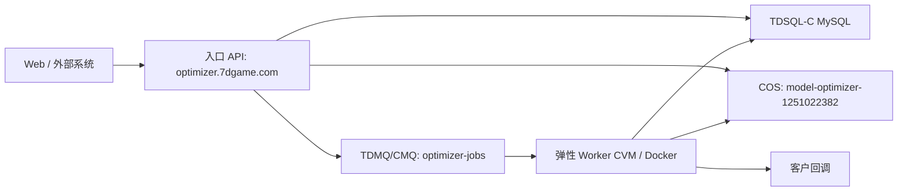

# Heavy Task Platform Runbook

本文档记录当前模型优化服务在腾讯云上的真实部署方式，并把它抽象成可复用的“重后端任务平台”。后续视频转码、CAD 预览、AI 批处理、文件转换等服务，都应优先沿用这套结构。

> 安全约定：本文档只记录资源名称、内网地址、部署拓扑和操作步骤。数据库密码、API Key、CAM Secret、镜像仓库密码、微信支付私钥等只进入 Portainer 环境变量、云控制台密钥管理或服务器本地环境文件，不写入仓库。

## 当前目标拓扑



当前采用 **入口常驻 + Worker 弹性池**：

- 入口服务器只跑 Control API，不跑重任务 Worker。
- 输入、输出、报告都在 COS。
- 任务状态、订单、Worker 心跳写入 TDSQL-C MySQL。
- 队列使用 TDMQ/CMQ，Worker 从队列拉任务。
- Worker 基准机用 Docker + systemd 启动容器；后续创建自定义镜像，再由竞价实例或伸缩组克隆。

## 已落地资源

| 类型 | 名称 / 地址 | 用途 | 状态 |
|---|---|---|---|
| 入口域名 | `https://optimizer.7dgame.com` | Control API 对外入口 | 已部署，可访问 |
| Portainer | `https://port.7dgame.com` | Docker Stack 管理 | 已部署 |
| COS bucket | `model-optimizer-1251022382` | 输入、输出、报告统一存储 | 已创建 |
| COS 地域 | `ap-nanjing` | 南京地域 | 已确认 |
| 队列 | `optimizer-jobs` | 主任务队列 | 已创建 |
| 死信队列 | `optimizer-jobs-dlq` | 超过重试次数的失败任务 | 已创建 |
| CMQ 内网地址 | `http://nj.mqadapter.cmq.tencentyun.com` | Worker 云内网消费队列 | 已确认 |
| CMQ 公网地址 | `https://cmq-nj.public.tencenttdmq.com` | 本地/入口公网联调 | 已确认 |
| 数据库 | TDSQL-C MySQL `cynosdbmysql-o6c4ezij` | 共享任务状态库 | 已接入 |
| 数据库内网 | `10.206.0.5:3306` | 云内网访问 MySQL | 已确认 |
| 数据库 schema | `async_task_platform` | 可复用重后端任务平台库 | 已创建 |
| 数据库账号 | `async_task_runtime@%` | API/Worker 运行时账号 | 已创建 |
| 镜像仓库 | `hkccr.ccs.tencentyun.com/plugins/3d-model-optimizer` | GitHub CI 推送镜像 | 已接入 |
| 入口 Stack | `model-optimizer` | Portainer API Stack | 已部署 |
| Worker 基准机 | `model-optimizer-worker-base` / `ins-big9dirk` | 制作 Worker 镜像的基准 CVM | 已释放，2026-05-28 |
| Worker 基准机内网 | `10.206.0.21` | Worker 访问 DB/CMQ/COS | 历史记录，实例已释放 |
| Worker 基准机公网 | `119.45.240.220` | 临时管理入口 | 历史记录，实例已释放 |
| Worker 自定义镜像 | `model-optimizer-worker-elastic-20260527-latest1` / `img-om8cggg4` | 弹性 Worker 克隆源，缓存并运行 `latest` | 当前使用 |
| 旧 Worker 镜像 | `model-optimizer-worker-elastic-20260527-fix2` / `img-d9cslozu` | 上一版 Worker 克隆源 | 已被 `img-om8cggg4` 替代 |
| 更旧 Worker 镜像 | `model-optimizer-worker-elastic-20260527-fix1` / `img-hmvlx5n2` | 更早 Worker 克隆源 | 已被 `img-d9cslozu` 替代 |
| 更旧 Worker 镜像 | `model-optimizer-worker-base-20260527` / `img-rxjo5rca` | 首版弹性 Worker 克隆源 | 已被 `img-hmvlx5n2` 替代 |
| CVM 启动模板 | `lt-model-optimizer-worker-spot` | CVM 购买页保存的竞价模板 | 已保存 |
| 运行时 CAM 角色 | `model-optimizer-runtime-role` / `4611686018446964541` | API、Dispatcher、Worker 实例角色 | 已绑定入口 CVM 和 Worker AS 启动配置 |
| AS 启动配置 | `asc-model-optimizer-worker-spot-latest2-sa9-role` / `asc-3x9u29bv` | SA9 兜底弹性 Worker 配置 | 当前主兜底配置，已绑定运行时角色 |
| AS 伸缩组 | `asg-model-optimizer-worker-spot` / `asg-pj6qaput` | SA9 兜底 Worker 弹性池 | 已验证，`0/0` 起步 |
| 蜂驰 Worker 池 | `asg-model-optimizer-worker-bf1-large8` / `asg-ov9ndzql` / `asc-pmmp5l4p` | `BF1.LARGE8` 低成本 Worker 池 | 已切到带角色启动配置，`0/0` 起步 |
| 蜂驰 Worker 池 | `asg-model-optimizer-worker-bf1-medium4` / `asg-o7ii5sub` / `asc-8er874b5` | `BF1.MEDIUM4` 2C4G Worker 池 | 已切到带角色启动配置，`0/0` 起步 |
| 蜂驰 Worker 池 | `asg-model-optimizer-worker-bf1-medium2` / `asg-9f3nd5an` / `asc-ai38mm43` | `BF1.MEDIUM2` 2C2G Worker 池 | 已切到带角色启动配置，`0/0` 起步 |
| CLS 日志集 | `model-optimizer` / `c4090ece-08de-4825-b658-9e3d21b58108` | 运行日志集中管理 | 已创建 |
| CLS 日志主题 | `model-optimizer-runtime` / `18967734-2ca0-40ea-a1c2-73e5b0e97acc` | API、Dispatcher、Worker 运行日志 | 已创建，30 天标准存储 |
| CLS 免费资源包 | `CLS预付费包` `10U` `3个月` | 新手体验资源包 | 已领取，订单实付 `0.00` |

## 入口服务部署约定

Portainer Stack `model-optimizer` 只应保留 API 服务：

```text
optimizer-api
```

入口服务职责：

- API Key 鉴权。
- 创建异步 Job。
- 写数据库。
- 生成/记录 COS input/output key。
- 投递 CMQ 队列。
- 查询任务状态和结果。
- 微信支付下单和支付回调。
- 客户回调管理。

入口服务不应处理大模型优化任务。若 Portainer Stack 中还有 `optimizer-worker`，应在完成 Worker 弹性池后永久移除，避免入口服务器被 CPU/内存任务拖住。

## Worker 基准机部署约定

Worker 基准机用于制作后续竞价机器镜像，不承载长期入口流量。

基准机需要包含：

- Docker Engine。
- 腾讯云镜像仓库登录状态，或启动脚本内完成登录。
- `/etc/model-optimizer/worker.env`，保存运行时环境变量。
- `/opt/model-optimizer/run-worker.sh`，负责启动 Worker 容器。
- `model-optimizer-worker.service` systemd 服务。
- Worker 容器启动后能消费 `optimizer-jobs`，处理任务并写回 COS/TDSQL-C。

Worker 容器约定：

```text
WORKER_CONCURRENCY=1
WORKER_IDLE_EXIT_SECONDS=300
JOB_LEASE_SECONDS=300
EXPIRED_JOB_RECOVERY_INTERVAL_SECONDS=30
WORKER_SPOT_TERMINATION_CHECK_URL=http://metadata.tencentyun.com/latest/meta-data/spot/termination-time
WORKER_SPOT_TERMINATION_POLL_MS=5000
QUEUE_PROVIDER=tdmq-cmq
QUEUE_ENDPOINT=http://nj.mqadapter.cmq.tencentyun.com
QUEUE_NAME=optimizer-jobs
STATE_STORE_PROVIDER=mysql
DATABASE_URL=mysql://async_task_runtime:<password>@10.206.0.5:3306/async_task_platform
COS_INPUT_BUCKET=model-optimizer-1251022382
COS_OUTPUT_BUCKET=model-optimizer-1251022382
TENCENT_REGION=ap-nanjing
```

克隆镜像前必须保证 Worker ID 不固定。推荐在启动脚本中从腾讯云 metadata 获取实例 ID：

```bash
META_ID="$(curl -fsS --connect-timeout 2 http://metadata.tencentyun.com/latest/meta-data/instance-id 2>/dev/null || true)"
if [ -n "$META_ID" ]; then
  export INSTANCE_ID="$META_ID"
  export WORKER_ID="worker-cvm-$META_ID"
fi
```

然后在 `docker run` 中显式覆盖：

```bash
-e INSTANCE_ID="$INSTANCE_ID" \
-e WORKER_ID="$WORKER_ID"
```

否则从同一个镜像克隆出来的机器会共享同一个 `workerId`，排查日志和心跳会混乱。

当前 Worker 实例不绑定公网 IP。若没有 NAT 网关，`run-worker.sh` 不应使用 `docker run --pull always`，否则 Docker 会先访问镜像仓库并因公网超时导致 Worker 无法启动。修复后的镜像 `img-hmvlx5n2` 使用自定义镜像里已经缓存的 Docker 镜像启动，后续升级镜像时通过 GitHub CI 推新 tag，再重新制作 Worker 自定义镜像或补充内网/公网拉取通道。

竞价实例必须按“随时会中断”处理：

- Worker claim job 时写入 `leaseExpiresAt`，处理期间按 `JOB_LEASE_SECONDS` 自动续租。
- Worker 只在结果和报告写入 COS、DB 标记 `succeeded` 后 ACK CMQ。
- 如果 Worker 被回收，未 ACK 的 CMQ 消息会重新可见；新 Worker 只有在 job 租约过期后才能重新 claim。
- 如果 CMQ 消息在原 Worker 仍处理时提前重新可见，新的 Worker 会删除该 receipt 并投递一个延迟 watchdog 消息，避免消息丢失或重复并发处理。
- Worker 会轮询 `metadata.tencentyun.com/latest/meta-data/spot/termination-time`，收到回收时间后进入 draining，不再领取新任务。
- 后续应在 AS 伸缩组启用竞价实例回收监测，并增加缩容生命周期挂钩，用于平滑停止 Worker 和上传日志。

## Worker 验收记录

已完成一次真实远程 Worker smoke test：

```text
jobId=9fbd477f-62e6-4044-9c2c-5f7cc6f97b79
workerId=worker-cvm-ins-big9dirk
status=succeeded
attempts=1
outputKey=tenants/remote-worker-smoke/jobs/9fbd477f-62e6-4044-9c2c-5f7cc6f97b79/output/model.glb
```

这说明：

- API 可以把任务写入 TDSQL-C。
- API 可以把任务投递到真实 CMQ。
- Portainer 入口 Worker 已停止后，基准 CVM Worker 仍能消费任务。
- Worker 可以从 COS 读取输入、执行优化、写回 COS、更新状态。

已完成一次 AS 弹性 Worker smoke test：

```text
jobId=c7d3a25c-bd9a-4df0-aa90-b573c684b09d
workerId=worker-cvm-ins-j06vzfdw
status=succeeded
attempts=1
outputKey=tenants/elastic-worker-smoke/jobs/c7d3a25c-bd9a-4df0-aa90-b573c684b09d/output/model.glb
reportKey=tenants/elastic-worker-smoke/jobs/c7d3a25c-bd9a-4df0-aa90-b573c684b09d/output/report.json
```

验证过程：

- `ins-big9dirk` 已先停机，确认入口服务器不承担 Worker 任务。
- 伸缩组 `asg-pj6qaput` 从 `0` 扩到 `1`，自动创建 `ins-j06vzfdw`。
- 首版镜像暴露两个启动问题：shell 变量被错误转义、无公网实例使用 `--pull always` 拉镜像超时。
- 在 `ins-j06vzfdw` 热修 `run-worker.sh` 后，Worker 成功 claim 并完成测试任务。
- 从热修实例创建新镜像 `img-hmvlx5n2`，并创建新 AS 启动配置 `asc-rkmzzkyj`。
- 伸缩组切到新启动配置后，缩到 `0` 再扩到 `1`，新实例 `ins-fss90ts4` 自动启动 Worker 成功。
- 验证后伸缩组已缩回 `0`，不继续产生 Worker 竞价实例费用。

已完成一次新版租约恢复 Worker smoke test：

```text
jobId=8f68c9d7-95ed-4fee-9da4-c4e2e2fe5fa4
workerId=worker-cvm-ins-5q8pdmoy
status=succeeded
attempts=1
outputKey=tenants/elastic-worker-smoke/jobs/8f68c9d7-95ed-4fee-9da4-c4e2e2fe5fa4/output/model.glb
reportKey=tenants/elastic-worker-smoke/jobs/8f68c9d7-95ed-4fee-9da4-c4e2e2fe5fa4/output/report.json
```

验证过程：

- 发现 `sha-121dbaf` 在 TDSQL-C MySQL 上执行过期租约恢复时，`LIMIT ?` 预编译参数会触发 `ER_WRONG_ARGUMENTS`。
- 修复为先校验内部 limit 数字，再在 MySQL SQL 中使用安全后的字面量；提交 `d465f02`。
- GitHub CI 成功推送 `hkccr.ccs.tencentyun.com/plugins/3d-model-optimizer:sha-d465f02`。
- 基准机 `ins-big9dirk` 拉取 `sha-d465f02`，修复启动脚本并加入租约/Spot metadata 环境变量。
- 从基准机创建新版镜像 `img-d9cslozu`，再创建 AS 启动配置 `asc-onk753cj`。
- `BF1.LARGE8` 竞价库存返回 `SpotSoldOut`，所以本轮 smoke test 使用 SA9 兜底启动配置拉起 `ins-5q8pdmoy`。
- 测试任务成功后伸缩组已缩回 `0`，基准机已停机。
- 已额外创建 `BF1.LARGE8`、`BF1.MEDIUM4`、`BF1.MEDIUM2` 三档蜂驰 Worker 池，均为 `min=0`、`desired=0`。

已完成一次 `latest` Worker 镜像滚动：

```text
workerBaseInstance=ins-big9dirk
dockerImage=hkccr.ccs.tencentyun.com/plugins/3d-model-optimizer:latest
customImage=model-optimizer-worker-elastic-20260527-latest1 / img-om8cggg4
sa9LaunchConfiguration=asc-model-optimizer-worker-spot-latest1-sa9 / asc-jhcn98fp
bf1Large8LaunchConfiguration=asc-model-optimizer-worker-spot-latest1-bf1-large8 / asc-58tnbry1
bf1Medium4LaunchConfiguration=asc-model-optimizer-worker-spot-latest1-bf1-medium4 / asc-g810xf8d
bf1Medium2LaunchConfiguration=asc-model-optimizer-worker-spot-latest1-bf1-medium2 / asc-aigxhst7
sa9RoleLaunchConfiguration=asc-model-optimizer-worker-spot-latest2-sa9-role / asc-3x9u29bv
bf1Large8RoleLaunchConfiguration=asc-model-optimizer-worker-bf1-large8-latest2-role / asc-pmmp5l4p
bf1Medium4RoleLaunchConfiguration=asc-model-optimizer-worker-bf1-medium4-latest2-role / asc-8er874b5
bf1Medium2RoleLaunchConfiguration=asc-model-optimizer-worker-bf1-medium2-latest2-role / asc-ai38mm43
```

验证过程：

- 入口 Stack 已改为 `hkccr.ccs.tencentyun.com/plugins/3d-model-optimizer:latest`，`/health` 返回正常。
- 基准机 `ins-big9dirk` 已拉取 `latest` 并用 `worker-cvm-ins-big9dirk` 启动 Worker 成功。
- 从基准机创建自定义镜像 `img-om8cggg4`，并分别更新 SA9 兜底组和三档蜂驰 Worker 池启动配置。
- 2026-05-28 已复制 4 个带 `CamRoleName=model-optimizer-runtime-role` 的新版启动配置，并将对应伸缩组切换过去；切换时四个 Worker 池均保持 `desired=0`。
- 四个伸缩组当前均为 `min=0`、`desired=0`、`inService=0`、`max=3`。
- 基准机 `ins-big9dirk` 已在 2026-05-28 释放；后续镜像维护需要重新拉起临时基准机，或直接从新实例完成验证后创建镜像。

已完成一次 `latest1` 冷启动弹性 Worker smoke test：

```text
jobId=682a51b8-67c9-429d-9815-7dbb6d09b4e2
workerId=worker-cvm-ins-c72wkhws
status=succeeded
attempts=1
outputKey=tenants/elastic-worker-smoke/jobs/682a51b8-67c9-429d-9815-7dbb6d09b4e2/output/model.glb
reportKey=tenants/elastic-worker-smoke/jobs/682a51b8-67c9-429d-9815-7dbb6d09b4e2/output/report.json
```

验证过程：

- SA9 兜底伸缩组 `asg-pj6qaput` 从 `0` 临时扩到 `1`，自动创建 `ins-c72wkhws`。
- 新实例使用 `img-om8cggg4` 和启动配置 `asc-jhcn98fp` 冷启动 Worker 成功。
- Worker 消费真实 CMQ 任务，从 COS 读取输入，处理后写回 COS，并更新 TDSQL-C MySQL 状态。
- 测试完成后伸缩组已缩回 `0`，四个 Worker 池均为 `desired=0`、`inService=0`。

已完成一次 Dispatcher 自动扩缩容 smoke test：

```text
deployedService=optimizer-dispatcher
asGroup=asg-pj6qaput
jobId=0c7928e0-e155-46ba-a7c7-96405e9ce893
workerId=worker-cvm-ins-3fv5utu4
status=succeeded
attempts=1
outputKey=tenants/elastic-worker-smoke/jobs/0c7928e0-e155-46ba-a7c7-96405e9ce893/output/model.glb
reportKey=tenants/elastic-worker-smoke/jobs/0c7928e0-e155-46ba-a7c7-96405e9ce893/output/report.json
```

验证过程：

- Portainer Stack `model-optimizer` 已新增 `optimizer-dispatcher`，命令为 `node dist/dispatcher/run-dispatcher.js`。
- Dispatcher 初始观测队列为空，保持 SA9 兜底伸缩组 `asg-pj6qaput` 为 `desired=0`。
- 提交真实 CMQ/COS 任务后，Dispatcher 将 `asg-pj6qaput` 从 `0` 自动扩到 `1`。
- AS 自动创建实例 `ins-3fv5utu4`，Worker 成功消费任务并写回 COS。
- 任务完成后，Dispatcher 将 `asg-pj6qaput` 自动缩回 `desired=0`，最终四个 Worker 池均为 `desired=0`、`inService=0`。

已完成 Dispatcher CAM 最小权限收窄验证：

```text
minimalPolicy=model-optimizer-dispatcher-as-minimal / 274388762
asFullAccessRemoved=QcloudASFullAccess
preRemovalJobId=c06b115f-76a1-4afa-9189-5e2a2d00c2bb
preRemovalWorkerId=worker-cvm-ins-9otcem7i
postRemovalJobId=5dd794c5-83eb-4870-8182-c365b5855cdb
postRemovalWorkerId=worker-cvm-ins-m6q6mezk
status=succeeded
attempts=1
outputKey=tenants/elastic-worker-smoke/jobs/5dd794c5-83eb-4870-8182-c365b5855cdb/output/model.glb
reportKey=tenants/elastic-worker-smoke/jobs/5dd794c5-83eb-4870-8182-c365b5855cdb/output/report.json
```

验证过程：

- CAM 自定义策略 `model-optimizer-dispatcher-as-minimal` 已绑定到运行时子账号 `modeloptimizer`。
- 保留 `QcloudASFullAccess` 时先跑一次 smoke test，确认新增策略不破坏现有链路。
- 从 `modeloptimizer` 移除 `QcloudASFullAccess`，保留 `model-optimizer-dispatcher-as-minimal`、`model-optimizer-runtime-policy` 和临时 TAT 策略。
- 移除后再次提交真实任务，Dispatcher 仍能用最小权限将 `asg-pj6qaput` 从 `0` 自动扩到 `1`。
- Worker `worker-cvm-ins-m6q6mezk` 成功处理任务；任务完成后 Dispatcher 自动缩回 `desired=0`、`inService=0`。
- 由于最小权限只授权 `asg-pj6qaput`，后续使用该子账号查询 AS 时只能看到该伸缩组，这是预期现象。

已完成运行时账号 TAT 权限清理：

```text
removedPolicy=QcloudTATFullAccess
runtimeUser=modeloptimizer
remainingPolicies=model-optimizer-dispatcher-as-minimal, model-optimizer-runtime-policy
healthCheck=https://optimizer.7dgame.com/health
healthStatus=ok
```

说明：

- 运行时 Dispatcher 不需要 TAT 远程命令权限，TAT 应只保留给人工运维账号或按需临时授权。
- 清理后 `modeloptimizer` 只保留 AS 最小权限策略和 COS/CMQ runtime 策略。
- 入口 API 健康检查正常。

已完成 2026-05-28 云端 P0 收口：

```text
runtimeCredentialCodeCommit=a46c2e
githubActionsRun=26528473445
releasedWorkerBaseInstance=ins-big9dirk
releasedWorkerBaseName=model-optimizer-worker-base
releasedWorkerBasePrivateIp=10.206.0.21
releasedWorkerBasePublicIp=119.45.240.220
retainedDisks=0
retainedEip=0
clsRegion=ap-nanjing
clsLogset=model-optimizer / c4090ece-08de-4825-b658-9e3d21b58108
clsTopic=model-optimizer-runtime / 18967734-2ca0-40ea-a1c2-73e5b0e97acc
clsStorage=standard
clsRetentionDays=30
clsFreePack=10U / 3 months / 0.00
clsFreePackOrder=20260528643147262207721
localTccli=3.1.99.1 / installed under user Python bin / not configured with saved credentials
runtimeRole=model-optimizer-runtime-role / 4611686018446964541
entryCvm=ins-11bytf4w / 7dgame.com（插件） / 10.206.16.3
entryStackSecretsRemoved=TENCENT_SECRET_ID,TENCENT_SECRET_KEY,TENCENT_TOKEN
runtimeRoleSmokeJob=a8b2db54-4286-4a95-879d-4d86721a5d25
runtimeRoleSmokeWorker=worker-cvm-ins-jzr9cig4
runtimeRoleSmokeStatus=succeeded
runtimeRoleSmokeAttempts=1
runtimeRoleSmokeOutput=tenants/runtime-role-smoke/jobs/a8b2db54-4286-4a95-879d-4d86721a5d25/output/model.glb
runtimeRoleSmokeReport=tenants/runtime-role-smoke/jobs/a8b2db54-4286-4a95-879d-4d86721a5d25/output/report.json
```

验证过程：

- 代码支持优先使用永久密钥兜底，永久密钥为空时从 CVM metadata 读取实例角色 STS 临时凭证；COS、CMQ 和 AS 客户端已改为请求时获取凭证。
- `npm run build` 和 `npm test -- --run tests/unit/cloud-runtime.test.ts` 通过；GitHub Actions Docker Build & Push `26528473445` 通过并推送 `latest`。
- 基准机 `ins-big9dirk` 已在 CVM 控制台执行销毁/释放，控制台显示操作成功，刷新实例列表后不再显示该实例。
- CLS 已开通并创建日志集 `model-optimizer`、日志主题 `model-optimizer-runtime`，用于后续 API、Dispatcher、Worker 统一日志采集。
- CLS 新手免费资源包已领取，费用中心订单显示 `日志服务CLS / CLS预付费包 / 交易成功 / 0.00`；领取时未勾选自动续费。
- 监控盘点结果：TDSQL-C 策略 `policy-uh3ag0g2` 已有系统预设通知模板，覆盖内存使用率和容量类指标；CVM 基础监控策略 `policy-u79zubvx` 已绑定 `系统预设通知模板`。
- 已创建运行时 CAM 角色 `model-optimizer-runtime-role`，并绑定 `model-optimizer-runtime-policy` 与 `model-optimizer-dispatcher-as-minimal`；入口 CVM `ins-11bytf4w` 已绑定该角色。
- 已将 SA9 兜底组和三档蜂驰 Worker 池切换到带 `CamRoleName=model-optimizer-runtime-role` 的新版启动配置；切换后四个 Worker 池均为 `desired=0`。
- Portainer Stack `model-optimizer` 已移除 `TENCENT_SECRET_ID`、`TENCENT_SECRET_KEY`、`TENCENT_TOKEN` 环境变量，`https://optimizer.7dgame.com/health` 返回 `ok`。
- 无永久腾讯密钥后提交真实任务 `a8b2db54-4286-4a95-879d-4d86721a5d25`，Dispatcher 将 `asg-pj6qaput` 从 `0` 扩到 `1`，Worker `worker-cvm-ins-jzr9cig4` 成功处理并写回 COS；完成后 `asg-pj6qaput` 自动缩回 `desired=0`、`inService=0`。
- 为创建带角色的 AS 启动配置，曾临时把 `QcloudASFullAccess` 重新绑定到运行时子账号 `modeloptimizer`，初始化完成后已立即解除；当前用户权限列表只剩 `model-optimizer-dispatcher-as-minimal` 和 `model-optimizer-runtime-policy`。
- 当前还没有为 `model-optimizer-1251022382` 创建专用 COS 告警，也没有业务级队列积压、Worker heartbeat 和 Job 失败率告警。

已完成真实强杀 Worker 恢复验证：

```text
jobId=41e5772e-10e1-4e02-9fe9-5297f32f8bcc
asGroup=asg-pj6qaput
inputBytes=97931468
gridSize=1650
firstWorkerId=worker-cvm-ins-i7cslhse
interruptedAt=2026-05-27 22:28:20 CST
recoveryObservedAt=2026-05-27 22:33:20 CST
secondWorkerId=worker-cvm-ins-a8k745rc
status=succeeded
attempts=2
outputKey=tenants/spot-recovery-test/jobs/41e5772e-10e1-4e02-9fe9-5297f32f8bcc/output/model.glb
reportKey=tenants/spot-recovery-test/jobs/41e5772e-10e1-4e02-9fe9-5297f32f8bcc/output/report.json
```

验证过程：

- 提交一个低于当前 100 MiB 输入上限的真实 GLB 任务，Dispatcher 自动将 `asg-pj6qaput` 从 `0` 扩到 `1`。
- 第一台 Worker `worker-cvm-ins-i7cslhse` claim 任务后，通过 AS 将 desired capacity 临时打到 `0`，模拟竞价实例回收或强制释放。
- 任务保持旧 Worker 的 `processing` 租约，等待 `JOB_LEASE_SECONDS=300` 到期，期间新 Worker 不会并发处理同一个 Job。
- 租约过期后，CMQ watchdog 和过期恢复逻辑重新投递任务，新 Worker `worker-cvm-ins-a8k745rc` 以 attempts=2 接手并成功写出 COS 结果。
- 测试完成后已手动将 `asg-pj6qaput` 缩回 `desired=0`、`inService=0`，避免继续产生 Worker 实例费用。
- 演练中额外验证了 116,554,268 bytes 输入会被当前 100 MiB 上限拒绝，任务按 `JOB_MAX_ATTEMPTS=3` 重试后进入 `failed`，不作为恢复通过记录。

## 创建 Worker 自定义镜像

镜像创建前检查：

- [ ] 入口 Stack 中本地 Worker 已停止或移除。
- [ ] 基准机 Worker 服务 `model-optimizer-worker.service` 正常运行。
- [ ] 启动脚本会按实例 metadata 生成唯一 `WORKER_ID`。
- [ ] `/etc/model-optimizer/worker.env` 不包含会阻止克隆的固定实例配置。
- [ ] 最新镜像 tag 已拉取成功。
- [ ] 用真实 CMQ/COS/TDSQL-C smoke test 通过。

建议镜像名：

```text
model-optimizer-worker-elastic-YYYYMMDD
```

建议描述：

```text
Model optimizer elastic worker baseline with Docker, systemd worker service, TDSQL-C, COS and CMQ runtime config.
```

创建后记录：

```text
CUSTOM_IMAGE_ID=img-hmvlx5n2
CUSTOM_IMAGE_NAME=model-optimizer-worker-elastic-20260527-fix1
SOURCE_INSTANCE=ins-j06vzfdw
STATUS=normal
CREATED_AT=2026-05-27 15:57 Asia/Shanghai
VERIFIED_AT=2026-05-27 16:02 Asia/Shanghai
SUPERSEDES_IMAGE_ID=img-rxjo5rca
```

## 弹性 Worker 池设计

第一阶段先使用竞价 CVM / 伸缩组，不立即接入 Batch。

推荐伸缩参数：

| 参数 | 建议值 | 说明 |
|---|---:|---|
| 最小实例数 | 0 | 无任务时不产生 Worker 费用 |
| 最大实例数 | 3 | 先防成本失控，压测后再调整 |
| 单机 slot | 1 | 当前 4C8G 基准机保守处理一个模型 |
| 扩容触发 | 队列可见消息数 > 当前空闲 slot | 后续由 Dispatcher 自动控制 |
| 缩容触发 | Worker 空闲 10-15 分钟 | 可用 `WORKER_IDLE_EXIT_SECONDS` 或伸缩组策略 |
| 失败重试 | 3 次 | 超过进入 DLQ / failed |

当前 Dispatcher 规则：

```text
required_slots = queued_jobs + retry_ready_jobs + active_processing_jobs + expired_processing_jobs
needed_instances = ceil(required_slots / slots_per_instance)
target_instances = clamp(needed_instances, min_instances, max_instances)
```

调度约束：

- 全局最大实例数必须配置。
- 每个租户最大并发必须配置。
- 每个 `taskType` 可以配置不同实例规格、slot、价格和超时时间。
- Spot 回收时不 ACK 消息，依赖 CMQ 可见性超时重投。
- 当前实现提供 `optimizer-dispatcher` 独立进程，使用 `node dist/dispatcher/run-dispatcher.js` 启动。
- 当前生产建议先配置 `DISPATCHER_AS_GROUP_IDS=asg-pj6qaput`，即 SA9 兜底组；蜂驰池等 Dispatcher 稳定后再加入。

Dispatcher 生产环境变量示例：

```text
DISPATCHER_PROVIDER=tencent-as
DISPATCHER_TASK_TYPE=model.optimize
DISPATCHER_AS_GROUP_IDS=asg-pj6qaput
DISPATCHER_INTERVAL_SECONDS=30
DISPATCHER_SLOTS_PER_INSTANCE=1
DISPATCHER_MIN_INSTANCES=0
DISPATCHER_MAX_INSTANCES=3
DISPATCHER_DRY_RUN=false
```

后续要优先用蜂驰降低成本时，可以把 `DISPATCHER_AS_GROUP_IDS` 改成逗号分隔的伸缩组列表。建议先灰度一组，观察 `SpotSoldOut` 和任务耗时后再把 BF1 放在 SA9 前面。

### 当前 Worker 弹性池

已创建的弹性池：

```text
CVM_LAUNCH_TEMPLATE_NAME=lt-model-optimizer-worker-spot
AS_LAUNCH_CONFIGURATION_ID=asc-rkmzzkyj
AS_LAUNCH_CONFIGURATION_NAME=asc-model-optimizer-worker-spot-fix1
AS_GROUP_ID=asg-pj6qaput
AS_GROUP_NAME=asg-model-optimizer-worker-spot
REGION=ap-nanjing
VPC_ID=vpc-f479q8cx
SUBNET_ID=subnet-plfjkdvy
SECURITY_GROUP_ID=sg-2b438jsc
IMAGE_ID=img-hmvlx5n2
SUPERSEDED_IMAGE_ID=img-rxjo5rca
SUPERSEDED_AS_LAUNCH_CONFIGURATION_ID=asc-lwvidj3l
INSTANCE_TYPE=BF1.LARGE8
SYSTEM_DISK=80GiB CLOUD_BSSD
PUBLIC_IP=false
MIN_SIZE=0
DESIRED_CAPACITY=0
MAX_SIZE=3
CURRENT_CAPACITY=0
CREATED_AT=2026-05-27 15:18:27 Asia/Shanghai
UPDATED_AT=2026-05-27 16:02 Asia/Shanghai
```

当前新版 Worker 弹性池：

```text
WORKER_IMAGE_ID=img-om8cggg4
WORKER_IMAGE_NAME=model-optimizer-worker-elastic-20260527-latest1
DOCKER_IMAGE=hkccr.ccs.tencentyun.com/plugins/3d-model-optimizer:latest
SA9_FALLBACK_AS_GROUP_ID=asg-pj6qaput
SA9_FALLBACK_LAUNCH_CONFIGURATION_ID=asc-jhcn98fp
BF1_LARGE8_AS_GROUP_ID=asg-ov9ndzql
BF1_LARGE8_LAUNCH_CONFIGURATION_ID=asc-58tnbry1
BF1_MEDIUM4_AS_GROUP_ID=asg-o7ii5sub
BF1_MEDIUM4_LAUNCH_CONFIGURATION_ID=asc-g810xf8d
BF1_MEDIUM2_AS_GROUP_ID=asg-9f3nd5an
BF1_MEDIUM2_LAUNCH_CONFIGURATION_ID=asc-aigxhst7
MIN_SIZE=0
DESIRED_CAPACITY=0
MAX_SIZE=3
UPDATED_AT=2026-05-27 18:06 Asia/Shanghai
```

说明：

- `MIN_SIZE=0` 且 `DESIRED_CAPACITY=0`，当前不会自动创建 Worker CVM。
- 镜像仓库只保留 `latest` 作为滚动 tag；短哈希 `sha-*` tag 用于历史调试的收益不抵腾讯仓库容量成本，后续不再生成，并由 CI 自动清理旧 `sha-*` tag。2026-05-27 已删除 13 个历史 `sha-*` tag。
- `MAX_SIZE=3` 是成本保护阈值，压测前不要放大。
- 启动配置未绑定公网 IP，Worker 只走内网访问 TDSQL-C/CMQ；COS 访问按腾讯云网络路径和账号权限处理。
- 当前运行时 CAM 子账号 `modeloptimizer` 已移除临时 `QcloudASFullAccess` 和 `QcloudTATFullAccess`，只保留 Dispatcher AS 最小权限策略与 COS/CMQ runtime 策略。TAT 权限只保留给人工运维账号或按需临时授权。

## Dispatcher CAM 最小权限

当前 Dispatcher 只需要查询伸缩组和修改期望实例数，不需要创建/删除伸缩组、启动配置、CVM、密钥或安全组。

腾讯云 CAM 文档说明 AS 是资源级授权产品，`ModifyDesiredCapacity` 和 `DescribeAutoScalingGroups` 都支持按伸缩组资源六段式授权。当前生产策略文件见：

```text
infra/tencent-cloud/cam/model-optimizer-dispatcher-as-policy.json
```

当前策略只授权 SA9 兜底伸缩组：

```text
qcs::as:ap-nanjing:uin/59643:auto-scaling-group/asg-pj6qaput
```

权限收窄顺序：

1. [x] 在 CAM 创建自定义策略 `model-optimizer-dispatcher-as-minimal`，策略内容使用 `infra/tencent-cloud/cam/model-optimizer-dispatcher-as-policy.json`。
2. [x] 先把该自定义策略绑定到运行时子账号 `modeloptimizer`，暂时保留 `QcloudASFullAccess`。
3. [x] 跑一次 Dispatcher smoke test，确认任务仍能把 `asg-pj6qaput` 从 `0` 自动扩到 `1`，完成后缩回 `0`。
4. [x] 测试通过后，从运行时子账号移除 `QcloudASFullAccess`。
5. [x] 再跑一次 smoke test，确认最小权限策略独立可用。

后续如果要让 Dispatcher 同时管理蜂驰池，需要先把对应伸缩组资源加入策略，再更新 Portainer 里的 `DISPATCHER_AS_GROUP_IDS`：

```text
asg-ov9ndzql   # BF1.LARGE8
asg-o7ii5sub   # BF1.MEDIUM4
asg-9f3nd5an   # BF1.MEDIUM2
```

## 运行时密钥迁移

生产运行时优先使用 CVM/AS 实例角色，不再把永久 CAM Secret 固化到 Portainer Stack、Worker 镜像或服务器文件中。

代码支持两种凭证来源：

1. 如果部署环境配置了 `TENCENT_SECRET_ID` 和 `TENCENT_SECRET_KEY`，继续使用现有永久密钥，兼容当前生产。
2. 如果永久密钥为空，则 API、Dispatcher 和 Worker 会从 CVM metadata 读取绑定 CAM 角色的 STS 临时凭证。

相关环境变量：

```text
TENCENT_CVM_ROLE_NAME=                         # 可选；为空时从 metadata 读取当前绑定角色名
TENCENT_CVM_ROLE_METADATA_URL=                 # 可选；默认使用腾讯云 CVM CAM role metadata 地址
TENCENT_SECRET_ID=                             # 迁移后留空
TENCENT_SECRET_KEY=                            # 迁移后留空
TENCENT_TOKEN=                                 # 使用实例角色时由 metadata 返回，不需要手工配置
```

迁移顺序：

1. [x] 创建或复用运行时 CAM 角色，绑定与 `modeloptimizer` 当前等价的 COS/CMQ runtime 权限和 Dispatcher AS 最小权限。
2. [x] 将入口 CVM 绑定运行时 CAM 角色。
3. [x] 更新 Worker AS 启动配置或实例模板，让新弹性 Worker 绑定同一个运行时 CAM 角色。
4. [x] 先保留永久密钥，部署支持实例角色的新镜像，跑一次 smoke test。
5. [x] 从 Portainer Stack 环境变量移除 `TENCENT_SECRET_ID`、`TENCENT_SECRET_KEY`、`TENCENT_TOKEN`。
6. [x] 重新部署入口 Stack，确认 `/health` 正常。
7. [x] 提交真实任务，验证 API、CMQ、COS、Dispatcher AS 和 Worker 全链路都能使用实例角色临时凭证。
8. [ ] 验证通过后，停用旧永久密钥；不要创建新的 `modeloptimizer` API key。

## 新服务接入模板

新增一个重后端服务时，不复制整套基础设施，只新增 task handler 和配置。

### 1. 定义 task type

```text
taskType=<domain>.<action>
```

示例：

```text
model.optimize
video.transcode
cad.preview
texture.compress
ai.batch-infer
```

### 2. 约定输入输出

```text
tenants/{tenantId}/jobs/{jobId}/input/<source files>
tenants/{tenantId}/jobs/{jobId}/output/<result files>
tenants/{tenantId}/jobs/{jobId}/report/report.json
```

### 3. 实现 Task Handler

每个任务类型只实现业务差异：

```text
validate(payload)
estimateCost(payload, inputMetadata)
selectResourceClass(payload, inputMetadata)
execute(context, payload)
buildReport(result)
```

平台继续复用：

- API Key。
- COS 上传授权。
- Job 状态机。
- CMQ 投递和重试。
- Worker 心跳。
- 租户限额。
- 计费订单。
- 客户回调。
- 监控告警。

### 4. 新增资源配置

每个 task type 至少配置：

```text
TASK_TYPE=<domain>.<action>
DEFAULT_PRICE_CENTS=<amount>
DEFAULT_TIMEOUT_SECONDS=<seconds>
DEFAULT_WORKER_CONCURRENCY=<slots>
DEFAULT_RESOURCE_CLASS=<small|medium|large|gpu>
MAX_SLOTS_PER_TENANT=<number>
```

如任务需要 GPU 或大内存，创建独立 Worker 镜像和独立伸缩组，但仍使用同一个 Control API、数据库和回调协议。

## 运维原则

- 密钥不进 Git。
- 入口不跑重任务。
- 文件不进 API 进程。
- Worker 本地磁盘只做临时 scratch。
- 所有任务必须可重试、可幂等、可查询。
- 每个新服务先固定 1 台 Worker 跑通，再开启弹性伸缩。
- 每次云上变更都同步更新本 runbook 和 `.kiro/specs/tencent-cloud-elastic-optimizer/tasks.md`。
