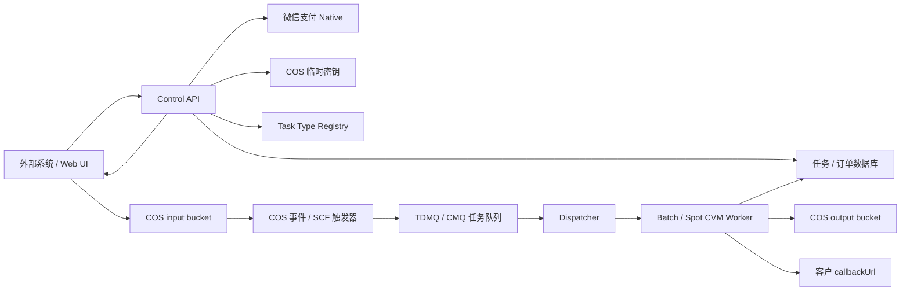

# 腾讯云弹性优化架构方案

本文档描述把当前同步模型优化服务改造成“COS 上传、异步排队、弹性计算、完成回调、微信扫码付费”的目标架构。该架构应抽象成可扩展的“重后端任务平台”，模型优化只是第一个任务类型。

## 现状判断

当前服务是单体 Express 应用：

- `POST /api/optimize` 和 `POST /api/optimize/stream` 接收 multipart 文件。
- 文件进入 Node 进程内存后写入本机 `./temp/{taskId}`。
- 同一个 Web 进程直接执行格式转换和优化流水线。
- 结果落本机 `./temp/results/{taskId}.glb`，下载接口从本地文件系统读取。
- `status` 主要依赖内存 Map 和本机文件存在性判断。

这意味着多个用户同时提交大模型时，Web API 进程会被 CPU、内存、磁盘 IO、外部转换工具一起拖住。横向扩容也会碰到本地文件和内存状态不共享的问题。

## 目标形态

把系统拆成五块：

1. **Control API**
   负责租户/API Key、任务创建、上传授权、微信支付下单、状态查询、回调签名和管理接口。

2. **COS**
   作为唯一可靠文件存储。输入模型、转换中间产物、输出 GLB、日志摘要都写 COS。本地磁盘只作为 Worker 临时工作目录。

3. **Queue + Dispatcher**
   上传完成后入队，队列削峰填谷。Dispatcher 根据队列积压和任务类型提交 Batch 作业，或调整 Spot CVM Worker 数量。

4. **Ephemeral Worker**
   每个 Worker 只处理有限任务，下载 COS 输入，运行现有 `convertToGLB` + `executePipeline`，上传结果到 COS，更新任务状态，发送业务回调，然后释放。

5. **Task Type Registry**
   把 `model.optimize`、`video.transcode`、`file.convert`、`cad.preview`、`ai.batch-infer` 等重后端任务注册成可插拔类型。控制面、队列、Worker slot、计费和回调都依赖统一任务合约，而不是写死模型优化。



## 推荐云产品

- **COS**：输入和输出文件的事实来源。前端和外部系统使用临时密钥直传，服务端只授权指定前缀。
- **TDMQ RabbitMQ 或 TDMQ CMQ 版**：任务队列。这里不需要复杂流处理，关键是 ACK、重试、死信、延迟重试和可观测性。
- **腾讯云 Batch**：首选计算调度方式。模型优化天然是批处理任务，只需要提供镜像、命令、输入输出路径，Batch 会调度 CVM 资源并在任务完成后释放。
- **CVM Spot / 竞价实例**：用于降低 Worker 成本。任务必须可重试，所有状态和文件不能只放实例本地。
- **SCF**：接收 COS ObjectCreated 事件，做轻量校验并投递队列；不要在 SCF 里跑优化。
- **数据库**：建议 TencentDB for PostgreSQL 或 MySQL。保存租户、任务、订单、回调、重试状态。
- **CLS / 云监控**：收集 API、Dispatcher、Worker 日志和指标。

## 两种接入方式

### 方式 A：推荐 API 接入

外部系统先向本服务创建任务，再上传 COS。这样能做鉴权、配额、计费和回调配置。

1. 外部系统调用 `POST /api/v1/jobs`。
2. Control API 创建 `jobId`，返回 COS 临时密钥和只允许写入的 `inputKey`。
3. 外部系统直传模型到 COS。
4. COS 上传事件触发 SCF。
5. SCF 校验对象前缀和任务状态后投递队列。
6. Worker 完成处理后把结果写入 `outputs/{tenantId}/{jobId}/optimized.glb`。
7. 服务端向客户 `callbackUrl` 发送带签名的完成通知。

创建任务示例：

```http
POST /api/v1/jobs
Content-Type: application/json
X-API-Key: <tenant_api_key>

{
  "taskType": "model.optimize",
  "filename": "chair.fbx",
  "preset": "balanced",
  "callbackUrl": "https://client.example.com/model-optimized",
  "callbackSecretId": "default"
}
```

响应示例：

```json
{
  "jobId": "job_01j...",
  "taskType": "model.optimize",
  "status": "waiting_upload",
  "input": {
    "bucket": "model-input-1250000000",
    "region": "ap-guangzhou",
    "key": "inputs/tenant_123/job_01j/source.fbx"
  },
  "upload": {
    "tmpSecretId": "...",
    "tmpSecretKey": "...",
    "sessionToken": "...",
    "expiresAt": "2026-05-26T10:30:00.000Z"
  }
}
```

### 方式 B：COS-only 接入

适合“其他系统只会往 COS 放文件”的场景，但必须同时上传 manifest，否则系统不知道该回调谁、用什么优化参数、按哪个租户计费。

约定路径：

```text
incoming/{tenantId}/{externalJobId}/model.zip
incoming/{tenantId}/{externalJobId}/job.json
```

`job.json` 示例：

```json
{
  "taskType": "model.optimize",
  "apiKeyId": "ak_live_xxx",
  "preset": "balanced",
  "callbackUrl": "https://client.example.com/model-optimized",
  "idempotencyKey": "client-order-10001"
}
```

COS 事件到来时，SCF 只在模型文件和 `job.json` 都存在、租户鉴权通过、未重复入队时创建任务。

## 可扩展任务类型

为了支持更多“重后端”任务，平台任务消息和数据库都必须包含 `taskType`。模型优化使用：

```text
taskType = model.optimize
```

未来可以扩展：

```text
video.transcode
file.convert
texture.compress
cad.preview
ai.batch-infer
```

每个任务类型提供同一组能力：

```text
validate(payload)
estimateCost(payload, inputMetadata)
selectResourceClass(payload, inputMetadata)
buildWorkerCommand(job)
parseResult(report)
```

共享平台只负责鉴权、租户限额、COS 输入输出、队列投递、重试、Worker slot 调度、计费订单、客户回调、状态查询和审计。具体任务逻辑由 task handler 完成。这样后续新增视频转码、CAD 预览、批量 AI 推理时，不需要重写控制面和调度面。

## 微信登录、充值和扫码付费

Web 产品使用微信登录、预充值钱包和微信支付 **Native 支付**。详细前端、扣费和发票设计见 `docs/frontend-payment-invoice-design.md`。

1. 用户通过微信扫码或微信内网页授权登录。
2. 用户选择 `10`、`30`、`50`、`100` 元充值档位。
3. Billing service 调用微信支付 Native 下单接口，获取 `code_url`。
4. Web UI 把 `code_url` 转成二维码展示。
5. 微信支付异步回调到 `POST /api/v1/payments/wechat/notify`。
6. 服务端验签、解密通知、幂等更新充值订单为 `paid`。
7. 支付成功金额进入用户钱包现金余额。
8. 创建任务时冻结 `100` 分，任务成功后正式扣费。
9. 系统失败或任务未开始前取消时释放冻结余额。

建议先支持两种计费模式：

- **Web 预充值付费**：微信登录后充值余额，每个任务扣 `1` 元。
- **API 租户余额 / 套餐**：客户系统通过 API Key 提交任务，按量扣余额或月底出账，不需要每次人工扫码。

发票按已实际消费的现金金额申请，不按未消费余额开票。启动期先支持人工开数电普通发票并回填下载链接，后续再接微信支付电子发票或第三方电子发票服务商。

订单状态必须独立于任务状态：

```text
order.created -> order.pending_payment -> order.paid
order.cancelled / order.expired / order.refunded

job.waiting_upload -> job.waiting_payment -> job.queued
job.processing -> job.succeeded / job.failed / job.cancelled
```

## 任务队列和弹性计算

## Docker Worker 和单机并发

每台弹性服务器只需要部署同一个 Docker 镜像，镜像里包含当前项目的 Node 服务、Python/CAD 转换依赖、`FBX2glTF`、`COLLADA2GLTF`、`toktx` 等工具。

推荐把“一个优化进程”定义成一个 **worker slot**：

- 一个 slot 同一时间只处理一个任务。
- 一台 CVM 可以有多个 slot。
- 调度系统按 slot 数量消费队列，而不是按机器数量消费队列。
- Worker 成功处理任务后 ACK 队列；进程崩溃或 Spot 被回收时不 ACK，任务重新进入队列。

单机并发建议先保守配置：

| CVM 规格 | 推荐 slot 数 | 说明 |
|---|---:|---|
| 2C4G | 1 | 只适合小模型和轻量压缩 |
| 4C8G | 1 | 默认起步规格，避免 CAD/纹理压缩爆内存 |
| 8C16G | 2 | 比较适合常规并发 |
| 16C32G | 4 | 适合队列积压时扩容 |
| 32C64G | 6-8 | 需要压测后再放大 |

可以用一个容器管理多个子进程，也可以一台机器启动多个容器。更推荐“一台机器多个 worker 容器”，因为隔离和回收更清楚：

```bash
docker run -d --name optimizer-worker-1 --restart unless-stopped \
  --cpus=4 --memory=8g \
  -e WORKER_CONCURRENCY=1 \
  -e QUEUE_URL=... \
  -e COS_BUCKET_INPUT=... \
  3d-model-optimizer-worker:latest
```

如果希望一个容器内部跑多个进程，则设置：

```bash
docker run -d --name optimizer-worker --restart unless-stopped \
  --cpus=8 --memory=16g \
  -e WORKER_CONCURRENCY=2 \
  3d-model-optimizer-worker:latest
```

Worker 启动后向数据库或 Redis 注册心跳：

```text
worker_id, instance_id, slots_total, slots_busy, last_heartbeat, draining
```

Dispatcher 根据下面的公式扩容：

```text
required_slots = queued_jobs + retry_ready_jobs
current_slots = sum(active_workers.slots_total)
needed_instances = ceil(max(0, required_slots - current_slots) / slots_per_instance)
```

Spot 回收或缩容前，把 Worker 标记为 `draining`：不再领取新任务，正在处理的任务尽量完成；如果来不及完成，任务依靠队列可见性超时重新投递。

### 首选：Batch 作业模式

Dispatcher 从队列取消息后提交 Batch 作业：

```bash
node dist/worker.js \
  --job-id "$JOB_ID" \
  --task-type "model.optimize" \
  --input "cos://model-input/inputs/tenant/job/source.fbx" \
  --output "cos://model-output/outputs/tenant/job/optimized.glb" \
  --options-json "$OPTIONS_JSON"
```

优点：

- 一任务或一批任务对应一批临时计算资源。
- 资源完成后释放，符合低成本诉求。
- 比自己管理伸缩组简单。
- 适合视频渲染、模型优化这类批处理。

### 备选：TDMQ + Spot CVM Worker 池

当 Batch 不满足镜像、地域、配额或启动速度要求时，使用 Worker 池：

- API 和 Worker 分开部署。
- Worker 订阅队列，每台机器并发数默认 `1`，避免模型转换互相抢内存。
- 伸缩策略按 `visible_messages + inflight_messages` 调整 Spot CVM 数量。
- 保留 1 台按量实例作为兜底 Worker，其他使用 Spot。
- Spot 被回收时，Worker 不 ACK 当前消息；消息超时后重新投递。

## Worker 职责

Worker 应复用现有优化代码，但从 HTTP 路由里拆出来：

1. 读取任务记录，抢占锁，状态改为 `processing`。
2. 下载 COS 输入到本地临时目录。
3. 如果是 ZIP，解压并寻找主模型。
4. 非 GLB 先转换为 GLB。
5. 执行优化流水线。
6. 上传结果、报告和可选日志到 COS。
7. 更新任务成功状态。
8. 发送客户回调。
9. 成功 ACK 队列消息；失败按可重试/不可重试分类处理。

不要在 Worker 本地保存长期结果。Spot 机器随时释放，本地磁盘只能当缓存。

## 回调协议

回调请求：

```http
POST https://client.example.com/model-optimized
Content-Type: application/json
X-Optimizer-Event: job.succeeded
X-Optimizer-Job-Id: job_01j...
X-Optimizer-Timestamp: 1779789600
X-Optimizer-Signature: sha256=<hmac>
```

Body：

```json
{
  "event": "job.succeeded",
  "jobId": "job_01j...",
  "externalJobId": "client-order-10001",
  "status": "succeeded",
  "result": {
    "outputKey": "outputs/tenant_123/job_01j/optimized.glb",
    "downloadUrl": "https://signed-cos-url",
    "originalSize": 104857600,
    "optimizedSize": 18273645,
    "compressionRatio": 0.174
  }
}
```

签名：

```text
HMAC_SHA256(callbackSecret, timestamp + "." + rawBody)
```

回调失败时重试，建议指数退避：

```text
1m, 5m, 15m, 1h, 6h, 24h
```

## API 草案

```text
POST   /api/v1/jobs                    创建任务并返回上传授权
GET    /api/v1/jobs/:jobId             查询任务状态
POST   /api/v1/jobs/:jobId/complete-upload  手动确认上传完成，可作为 COS 事件兜底
POST   /api/v1/jobs/:jobId/cancel      取消未处理任务
GET    /api/v1/jobs/:jobId/result-url  获取短时下载 URL

POST   /api/v1/cos/events              SCF 内部调用，处理 COS 事件
POST   /api/v1/payments/wechat/native  创建微信 Native 支付二维码
POST   /api/v1/payments/wechat/notify  微信支付回调
GET    /api/v1/orders/:orderId         查询订单状态
```

## 数据表草案

```text
tenants
  id, name, status, billing_mode, created_at

api_keys
  id, tenant_id, key_hash, status, scopes, created_at, last_used_at

jobs
  id, tenant_id, external_job_id, status, preset, options_json
  task_type, task_payload_json, resource_class
  input_bucket, input_key, output_bucket, output_key
  callback_url, callback_secret_id
  attempts, error_code, error_message
  created_at, uploaded_at, queued_at, started_at, completed_at

orders
  id, tenant_id, job_id, status, amount_cents, currency
  payment_provider, out_trade_no, transaction_id
  code_url, expires_at, paid_at, created_at

job_events
  id, job_id, type, payload_json, created_at

callback_deliveries
  id, job_id, event_type, url, status, attempts
  last_status_code, next_retry_at, created_at, updated_at
```

## 迁移步骤

### 第 1 阶段：把优化核心拆成 Worker

- 新增 `src/worker.ts`，接受本地输入输出路径和 options。
- 把 `routes/optimize.ts` 中“解压、转换、优化”的逻辑抽成可复用服务。
- 现有 HTTP 上传接口继续可用，降低改造风险。
- 新增 `src/tasks` task type registry，先注册 `model.optimize`。

### 第 2 阶段：引入任务数据库

- 用数据库替代 `status.ts` 的内存 Map 和本地文件判断。
- 增加 job/order/event 表。
- 本地模式下也写数据库，保持行为一致。

### 第 3 阶段：接入 COS

- 增加 COS Storage Provider。
- 增加 `POST /api/v1/jobs` 和临时密钥签发。
- 下载接口改为返回短时签名 URL，或由 API 代理下载。

### 第 4 阶段：队列与 Worker

- 增加队列生产者和消费者。
- Worker 从 COS 拉取输入、输出到 COS。
- 支持失败重试、死信队列、幂等锁。

### 第 5 阶段：弹性计算

- 优先接入 Batch 提交作业。
- 备选接入 TDMQ + Spot CVM Worker 池。
- 设置队列深度告警、任务超时告警、成本告警。

### 第 6 阶段：微信支付

- 增加订单表。
- 接入 Native 下单，返回二维码链接。
- 实现微信支付回调验签、解密、幂等入账。
- 支付成功后触发任务入队。

### 第 7 阶段：客户回调

- 实现回调签名。
- 失败重试和回调投递记录。
- 管理端可重放回调。

## 关键风险

- **Spot 回收**：任务必须幂等可重试，结果只以 COS 和数据库为准。
- **大文件上传**：优先前端直传 COS，API 不做代理上传。
- **ZIP 安全**：解压需要防 Zip Slip、文件数量限制、解压后总大小限制。
- **重复 COS 事件**：用 `inputKey + etag + jobId` 做幂等。
- **回调可靠性**：客户接口不可用时不能丢结果，必须可重试和可查询。
- **支付安全**：微信支付回调必须验签和解密，不能只相信客户端支付状态。
- **成本失控**：限制租户并发、单文件大小、单任务最长运行时间和最大 Worker 数。

## 参考

- 腾讯云 COS：<https://cloud.tencent.com/document/product/436>
- COS 临时密钥：<https://cloud.tencent.com/document/product/436/14048>
- 腾讯云 TDMQ：<https://cloud.tencent.com/product/message-queue-catalog>
- 腾讯云 Batch：<https://cloud.tencent.com/document/product/599>
- 腾讯云 CVM Spot：<https://cloud.tencent.com/document/product/213/17816>
- 微信支付 Native 下单：<https://pay.wechatpay.cn/doc/v3/merchant/4012791877>
- 微信支付回调通知：<https://pay.wechatpay.cn/doc/v3/merchant/4012791861>
